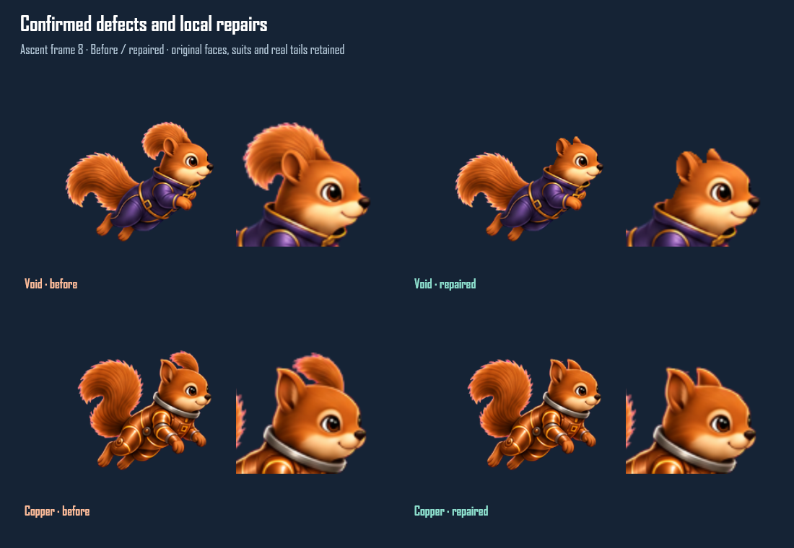

## Audit triggered by owner feedback

The owner reported Void drift and a tail in the head. The earlier claim that
visual review was complete was incorrect. PR #246 was returned to draft
while these findings were investigated.

Confirmed in commit a966b9e:

1. Void ascent 8 has a second fur plume above/behind its ear while the normal
   tail remains behind the pelvis. This is visible in both the generated
   master and exported PNG; the runtime did not introduce it.
2. Copper ascent 8 has a smaller extra tuft above the skull, also present
   in the source and exported PNG.
3. The offline review's companion playback was about 4.57 fps at its Normal
   setting, while production plays those loops at 12 fps. That made the
   review less representative of the shipped motion.

Why the existing checks missed this: DOME position, fitted skull radius,
pupil position and aggregate near/far changed-ink ratio do not test anatomy.
The area calculation counted only ink inside the fitted head circle, so a
large extra plume just outside that circle was invisible to that check.
Hashes only froze the defective result. The manual review also missed it.

The repeat audit inspected all nine standard masters, exported head/whole
contacts and all three approved companion loops. Ion, Sammie, Gemmie,
Leviathan, Ember, Frost, Ghost, Quill, Noodle and Bandit did not show the same
duplicated head-plume defect in this review. A diagnostic silhouette scan
also flagged close tail clearance on Void descent 4 and small shoulder,
ear or muzzle changes on five other suits; those flags were inspected
individually and must not be treated as anatomy failures merely from a count.

## Corrections and evidence

Void ascent 8 uses the generated edit's alpha only in [148,45,221,105].
Copper ascent 8 removes its plume in [181,45,229,86] and restores the real
rear ear from ascent 7, translated one pixel with its registered head path,
inside [193,45,229,86] with a three-pixel boundary blend. This extra step
was necessary because alpha-only erasure left tail texture inside the ear.
The original face, costume and real tail pixels outside these crown
rectangles are byte-identical. No other motion frame or portrait changed:
190 motion PNGs and 12 portraits retain the a966b9e blob hashes.

The new crown check registers each pose to its neutral head position and
allows a five-pixel silhouette envelope. Its central upper-head region
includes the two observed defects while excluding the legitimate rear
tail and lower face/collar. It permits up to 40 unexpected opaque pixels.
The saved original Void frame produces 321 and Copper produces 206, so
both fail. Both repaired frames produce zero. The maximum among other
standard frames is 12. This is a narrow regression, not an anatomy model.

The regression also compares the repairs directly with the original PNGs
and rejects any pixel changes outside the recorded crown rectangles.
It runs as part of verify-art.py, which now passes 32 groups. Source/lab
builds, TypeScript, production-painter motion/helmet tests and the helmet
regression pass on the corrected art. The full 46-test result before this
audit was 41 pass/5 fail; those five were reproduced on unchanged b223820
and again on unchanged 100ca6e during integration. Final integrated-suite
results are recorded in README.md.
Existing whole-bank spread diagnostics still report pose width changes,
including tail motion in this scope; they are not semantic drift checks.

The refreshed offline review plays companions at 12 fps with an independent
clock. The previous coupled clock produced 4.57 fps. Standards retain the
review's synthetic rise/fall sweep; live input behavior is tested through
the production painter separately.

The audit fixes the two confirmed anatomy defects and the review clock.
It does not claim that numeric thresholds prove zero costume drift or that
a contact-sheet inspection guarantees every visual transition is ideal.
