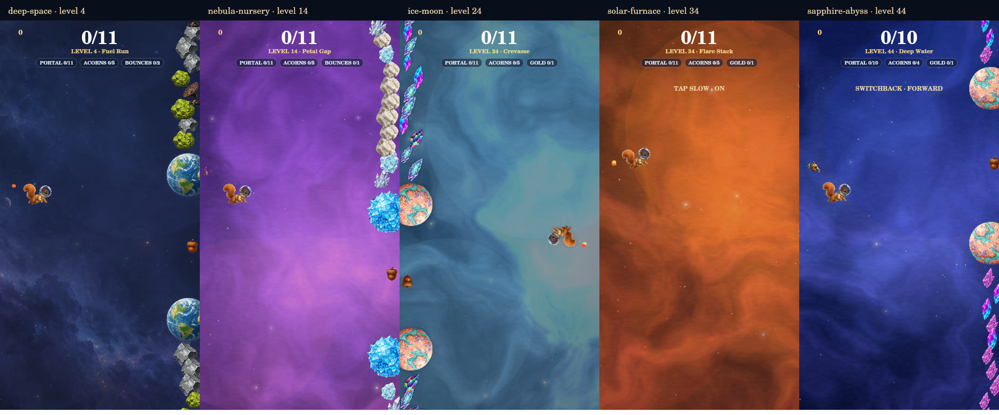

# Full beta Star Map — first playtest pass

The owner approved making beta itself the proposal. This supersedes the
30-mission access limit in STAR_MAP_SAMPLE.md and the separate sample link.
Based on main `24dd0ef` (merged #181); open #182 only changes the marketing site.

Open `/beta/` and choose Star Chart: **260 missions, 780 stars, all missions
unlocked**. The existing continuous climbing road, zone paintings, matching
planets/debris and soft scenery overlaps remain. There are no ten-level panels.
The old `?star-map=sample` URL now enters the same beta campaign and save.
Production retains its 100 missions/300 stars and original progression.

## Mission mix

Each of the 26 zones has six normal-flight variations (five shorter missions
and a longer finale), one Lost in Space, one Deep Space/black-hole-shift run,
one Arcade and one Spill mission. Mission 1 remains its original forgiving
8-gate flight with unlimited recovery. The rest are explicit beta contracts
in `game/beta-campaign-manifest.ts`, each with goals, modifiers, a challenge
brief, a duration estimate, immutable seed and predecessor identities.

The estimates are first-pass playtest targets, not measured completion times.
Spill estimates exclude time spent at an untimed Depot. They are not timers.

| Slot within the zone | First-pass purpose |
|---|---|
| 1 | Short introduction with open gaps; mission 1 stays unchanged |
| 2 | Authored pal flight (magnet, soft bounce, low gravity, long slow or steady gates) |
| 3 | Shorter, faster crossing with a generous tap budget |
| 4 | A springy, sticky, upside-down, tap-slow, reversal or stronger-sway experiment |
| 5 | A longer endurance flight at a comfortable pace |
| 6 | Lost in Space with extra room around the tilting gates |
| 7 | Existing Deep Space shifts with open gaps and no added fog |
| 8 | Spill: an explicitly selected wave, mined-Ore or Depot objective |
| 9 | Arcade with the zone's existing planet family |
| 10 | A longer flight finale; clean-flight stars can be earned on replays |

These are authoring slots, not new UI divisions. The requested mix was a
vision, not a locked template: this is one concrete pass for trying it.

## Spill pacing

The explicit first-star targets are shown below. Ore means Ore mined over
the run, including Ore already spent; stipends do not count. Depot means
arriving at that Depot. Repair bonus stars count a successful hull-repair
purchase, not a full-hull purchase attempt or automatic docking repair.
No mission forces damage merely to continue; repair is an optional replay star.

| Level | First-star target |
|---:|---|
| 8 | 1 wave |
| 18 | 2 waves |
| 28 | 35 Ore |
| 38 | 3 waves |
| 48 | 3 waves |
| 58 | 60 Ore |
| 68 | Depot 1 |
| 78 | 4 waves |
| 88 | 80 Ore |
| 98 | 5 waves |
| 108 | Depot 1 |
| 118 | 100 Ore |
| 128 | 6 waves |
| 138 | 6 waves |
| 148 | Depot 2 |
| 158 | 120 Ore |
| 168 | 8 waves |
| 178 | 10 waves |
| 188 | 140 Ore |
| 198 | Depot 2 |
| 208 | 12 waves |
| 218 | 14 waves |
| 228 | 16 waves |
| 238 | 18 waves |
| 248 | Depot 3 |
| 258 | 20 waves |

This table is authored content, not a runtime formula based on zone number.
Ordinary Spill stays endless, with its existing wave-20 first-pass milestone,
untimed Depot and continuation beyond wave 20. Production's nine original
Spill missions retain their targets, goals and seeds.

## Experiments to try first

- **4:** springy planets; two bounces are a bonus objective.
- **14:** sticky planets; contact holds the playfield until a tap releases it.
- **24:** upside-down flight; the playfield rotates 180°, while HUD and menus
  stay upright. Inputs retain their world direction.
- **34:** every tap toggles the existing freeze-acorn slow factor on/off;
  collected freeze power-ups keep their own duration.
- **44:** Switchback's reversal flight. The launch heads forward; every next
  tap reverses actual world scrolling. Previously scored gates stay scored,
  and revisiting the corridor does not increase the distance difficulty.

**Switchback** is a new beta-only pal, available in Loadout. It also works in
endless normal flight. Other modes show it cosmetically without reversal.
Authored mission pals override the equipped companion for that run only;
loadout choices and the Pal Effects Off setting are not changed. A mission's
listed pal remains part of its challenge even when loadout effects are off.
Switchback from the loadout cannot silently alter unrelated campaign missions.

The reversal experiment retains the finite mission corridor. Endless flight
retains a bounded recent corridor (12 viewport widths); backtracking beyond it
enters empty space until the pilot taps forward again. That limitation is
intentional for this first test; a bidirectionally generated endless world is
not implemented. HUD labels expose direction, sticky contact and tap-slow state.

The original transparent pal sprite is `art-src/pals/switchback.png`, copied
unchanged to `docs/art/solo/switchback.png`. It was made with the built-in
image-generation tool using TinTin and TurClock as style references. The exact
prompt is in [switchback-prompt.txt](switchback-prompt.txt). It has a still
sprite and the game's existing companion bob; no new animation bank.

## Identity and migration mapping

| Existing data | Mapping in this beta |
|---|---|
| Production mission definitions and seeds | Retained in `campaign-manifest.ts`; production still selects the original 100 |
| Mission 1 | Same mission, goals, identity and forgiving behavior |
| Other route mission IDs | Same route ID; active progress ID is `beta-260-v1:<route ID>` |
| Historical beta tunnel IDs | Retained as predecessors of the same route position; archived seeds 7014–7094 remain in the old manifest |
| Old mission stars and passage | Transfer as a credit floor and passage; old objective bits do not certify new goals |
| Successful replays | Union current objective identities; failed runs add no stars |
| Old beta/sample objective records | Kept under their original IDs; nothing deleted |
| Display order | Never used to derive a runtime seed or objective ID |
| Existing numeric mission seeds | Retained as literal values; revised variants replacing old random flights receive explicit new seeds |
| Barrier clears | Same three identities after 33/66/99, with 2:30/2:00/1:42 requirements |
| Existing beta save | Same `acornaut_illust_beta` slot; production slot stays separate |
| Old separate sample save | Imports credit, passage, zone visits and owned cosmetics once; original slot stays intact |
| Wallet and reward receipts | Existing beta balances/receipts retained; normal eligibility settles any newly reached legacy reward once |
| Extended reward concepts | Visible on beta's rail/gallery; unfinished concepts remain labeled and ungrantable |

The allStars entitlement retains its historical 300-star floor. It does not
mark any mission complete. Beta bypasses mission locks for testing, including
barrier access; production still requires all three barriers and unlocks
Hyper Run mode after the first clear. No barrier relocation is included.

## Verification and limits

The regression suite checks all 260 beta launches and completion seams,
production's 100-mission engine progression, both old and revised contracts,
credit transfer and replay unions, first-mission recovery, mission seeds,
barrier timing/access, actual sticky collisions/release, reversal without
repeat scoring, stronger rebounds, tap slow, Ore/Depot completion and repair
purchase counters. Existing Spill progression/UI and HUD suites remain gates.

Native canvas checks use the game's actual painters and sprites, including
the inverted playfield and Switchback; they are not browser screenshots.
Browser CSS, phone input, performance, reversal feel, and all duration/difficulty
estimates still require human playtesting. This PR does not merge or deploy.

