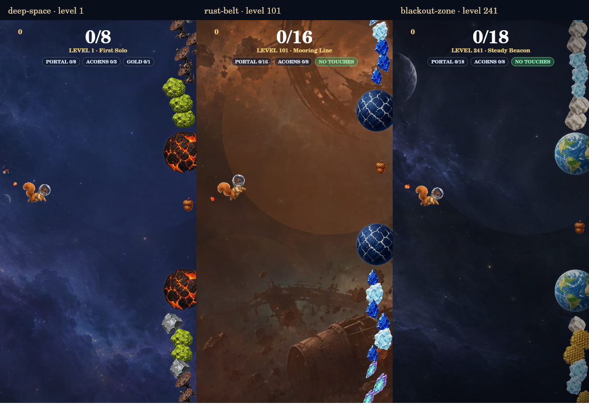
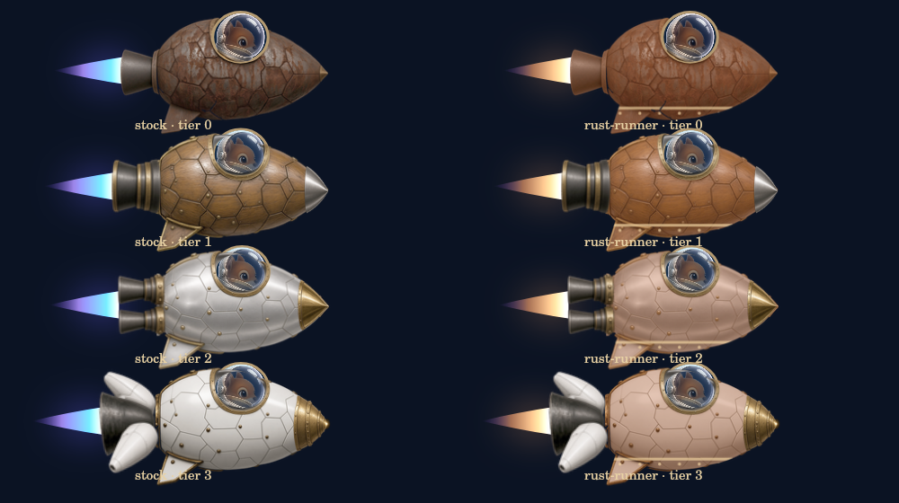

# Star Map expansion: first review sample

This branch implements the approved first step: align the original road with
its zone artwork, establish the 260-mission manifest, and make a bounded
30-mission sample playable. It is based on main
`19563521b9a6dad1737cfda7f921b711ea65b8f4`, including merged PR #179's
ship-centered Spill Depot and Ships Loadout. No other PR was open at the
implementation-base check.

## Scope and entry points

| Surface | Route | Playable content | Save |
|---|---|---|---|
| Production | Original 100 missions / 300 stars | Original mission contracts and production locks | Existing production key, with additive migration |
| Normal beta | Original 100 positions / 300 stars | Existing beta variants and access rules | Existing beta key, with additive migration |
| Beta with `?star-map=sample` | Draft 260 positions / 780-star ceiling | Deep Space 1–10, Rust Belt 101–110, Blackout Zone 241–250 | `acornaut_star_map_sample_v1`; no save import |

Serve `docs/` over HTTP. In beta, open the Star Chart and choose **Explore the
Star Map sample**. The sample's three zone buttons find the playable stretches.
Other positions are visible and labeled outside the sample; the engine rejects
their launch. **Return to beta** returns to the ordinary beta save.

The sample header's 780 is the full draft route ceiling; this sample exposes
90 earnable stars. The original 300-star reward ladder remains in use. No
reward above 300 is paid, sold or advertised as available by this branch.

## Continuous road and art

The climbing road retains global level numbers and its existing curves.
Backgrounds overlap for four mission spacings, with painted color, procedural
stars and faint decorative debris. Zone names provide quiet location clues;
there are no chapter panels, boundary lines or ten-level completion screens.

All original 100 nodes now select a planet from their zone's `planetBias`
family. Decorative debris uses that zone's `debrisBias`. Selection is a stable
hash of mission identity, so changing display order will not change a node's
planet. These are the game's existing families; gameplay's existing planet
selection rules remain in place.

Deep Space, Rust Belt and Blackout Zone share three new painted panoramas
between the map and illustrated flight. They sit beneath the procedural stars,
with quiet flight lanes and zone-specific portrait crops. Other zones retain
their existing paintings and catalog colors pending later art passes.
Arcade keeps its existing retro painter. Spill retains its own painted scene.

The map creates canvases for at most 48 nearby mission nodes. Distant zone
decorations and backgrounds are released; scenery listeners are disposed when
the screen changes. The flight painting cache is bounded to six images and
falls back to the existing sky on an image failure.

**Return to pilot** returns to the next mission or blocking barrier. Search
accepts a global level number, mission name or zone name. The current-zone
label follows the visible road. Focus outlines, labeled level buttons and
44-pixel navigation targets support keyboard/touch review. Route lookup and
next-mission navigation use the manifest array, allowing later appended content.

## Preserved progression contracts

| Contract | Behavior |
|---|---|
| First mission | Eight gates, `noFail`, unlimited crash recovery; completing the flight earns stars |
| Independent stars | Successful replays union verified objective identities; failed replays add none |
| Hyper Run barrier 1 | After 33; finish in **2:30 or faster**, 9,000 ticks |
| Hyper Run barrier 2 | After 66; finish in **2:00 or faster**, 7,200 ticks |
| Hyper Run barrier 3 | After 99; finish in **1:42 or faster**, 6,120 ticks |
| Barrier attempt | The next uncleared barrier must be reached both when the attempt launches and when it settles |
| Hyper Run mode access | Production unlock remains the first barrier clear; beta keeps its existing access bypass |
| Spill endless | Untimed Depot, wave-20 first-pass milestone, continuation to wave 21 and beyond |
| Existing Spill missions | Nine unchanged targets: 4, 5, 6, 7, 8, 9, 10, 11, 20 waves; existing Ore/no-hit goals and seeds |

There are exactly three barriers, and they award no campaign stars. Positions
90/180/259 have not been adopted. Their relocation and resulting mode-access
changes remain a separate owner decision. No Spill mission is generated from
a zone number, and this branch does not modify `spill.ts` or `spill-content.ts`.

Blackout's campaign strobe is removed from both render paths and the tap clock.
The affected original missions use steady fog and existing sway parameters;
the new Blackout sample varies existing pace, gap width, sway and steady fog.
Original mission modes, gate/wave targets and three objective definitions are
preserved, including Spill. This removes flashing without adding a mechanic.

## Save mapping

`campaignProgress.version = 1` is an additive namespace. `save.stars`, numeric
barrier clears, purchase arrays, reward balances and unknown fields remain.
Before migrating an unversioned save, its exact source is backed up once at
`<active save key>:before-campaign-v1` when storage is available.

| Existing data | Mapping |
|---|---|
| IDs `1-1` through `10-10` | Same IDs and positions 1–100; explicit per-mission mapping in `star-map-260.json` |
| Compatible goal bits | Copy only into the corresponding immutable objective IDs |
| Unversioned `2-8` through `10-8` | Preserve raw mask, star count and finish passage; current Spill checklist starts unverified because these IDs previously described other missions |
| Unversioned beta `2-4` through `10-4` | Same conservative policy; current Wormhole objectives have `beta-tunnel-N-4` progress identities |
| Unknown source page for an imported legacy save | Treat the nine `N-4` slots conservatively on either page |
| Versioned production-to-beta import | Transfer route passage and credit to the corresponding variant, without copying flight objective checkmarks into Wormhole goals |
| Old cached build adds stars to an already-versioned save | Import the additional credit and passage on the next load, keeping those added bits opaque |
| Per-mission credit | `max(carried credit, verified current-objective count)`, capped at three; old and new contracts cannot double-credit one slot |
| `raceGates: 33/66/99` | Preserve numeric clears and add `hyper-barrier-1/2/3` receipts; no time revalidation |
| `dustPaidTo` | Preserve watermark; add stable IDs for already-paid original Dust rewards, preventing repeated payouts |
| Purchased/earned inventory | Preserve purchases, unlocked suits, helmets, pals, trails, balances and mode eligibility; unlocked suits remain visible |
| `allStars` | Preserve the original 300-star entitlement floor; do not fabricate mission completion or increase it to 780 |
| Zone visits | Preserve names, add stable zone IDs; backfill only compatible completed flight missions that prove a fixed-zone visit |

Credit retained from an older contract appears as star credit on the map. The
mission sheet explains carried credit when its current checklist has fewer
verified goals. Only successful replays verify those current objectives.

New missions use stable slug IDs. Goal IDs include a hash of the goal, mode and
finish target. Contract hashes include the mode, target and all three goals.
Tests reject accidentally changed contracts or objective hashes. Renaming a
mission or changing its display order cannot change its stored seed.

| Mission family | Seed policy |
|---|---|
| Original ordinary flight missions | Explicit `null`; retain historical random runs |
| Nine original Spill missions | Literal 5018, 5028, 5038, 5048, 5058, 5068, 5078, 5088, 5098 |
| Nine beta Wormhole variants | Literal 7014, 7024, 7034, 7044, 7054, 7064, 7074, 7084, 7094 |
| New flight missions | Literal authored uint32 seeds; frozen `flight-seeded-v1` generator; geometry RNG separated from visual randomness |
| Endless modes | Existing random seed behavior |

Seed repeatability assumes the same viewport, loadout and inputs. It does not
replace the game's existing viewport geometry or pal effects.

## Rewards and Spill appearance proof

The existing 53 functional reward entries keep their thresholds and prices,
including 715 total Star Dust and the original 300-star title and Cat Suit.
Nine obsolete chapter-unlock rows remain compatibility data, filtered from
reward presentation and generated documentation.

The extension in `star-map-rewards.ts` and `star-map-260.json` is data-only:
25 proposed entries at 24 thresholds from 320 to 780, including 595 additional
Star Dust and restrained Spill appearances/companions. It is not imported by
the production reward ladder. Final reward content and amounts remain subject
to review.

In the isolated sample's **Ships Loadout**, **Rust Runner hull** adds a warm
copper finish and cream rivet band to the existing hull. **Rust Wake exhaust**
recolors the existing plume. Both preserve ship geometry, fitting, modules,
physics and run state. They are freely toggled appearance proofs for review.
**Rivet** is explicitly a placeholder using Tinbot artwork, with no equip
control or ability. See the [asset brief](../../art-src/zone-scenes/README.md).

## Audit against the implementation base

| Finding verified on main `1956352` | Evidence and change |
|---|---|
| Guaranteed acorns could be displaced | `spawnPair` reserved `acornEvery` only when `noPick` was true. For other pilots a power-up or planned gold claimed the slot first. The guaranteed plain acorn is now reserved for every pilot; planned gold is separated along the lane and optional holes cannot occupy a reserved campaign slot. Endless pickup rules stay unchanged. |
| Fixed-zone visits were unrecorded | `resetRun` pinned both environment fields to the mission zone, while visits were recorded only when the environment changed. The first actual playing frame now records the fixed zone; opening a briefing or waiting on ready does not count. |
| Chapter unlock documentation was outdated | `levelUnlocked` already used predecessor completion and mandatory barriers, while the roadmap builder and reward comments still described star-gated chapters. The builder now reports actual runtime progression and omits obsolete chapter rewards. |
| 100/300 assumptions were scattered | Map/hub totals, ordinal-to-ID barrier lookups, stage arithmetic for next mission, reward copy and `allStars` conflated route size with legacy eligibility. Display totals now derive from the selected route, navigation uses ordered IDs, and 300 remains only an explicit original entitlement/threshold. The 100-row publication boundary is deliberate for this PR. |
| A mode replay could clear an unreached next barrier | Settlement previously checked only the first uncleared barrier and the clock. Attempts now bind to a reached barrier at launch and recheck it at settlement, preserving existing banked clears. |

The proposed future route is specified in [star-map-260.json](star-map-260.json):
26-zone order, 260 explicit mode/challenge/objective rows, duration targets,
neighbor distinctions, 100 legacy mappings, seeds and reward proposals. Duration
ranges are playtest targets, not additional timers. The original design
snapshot is [STAR_MAP_SPECIFICATION.html](STAR_MAP_SPECIFICATION.html).

## Validation and review

Automated checks exercise production, beta and isolated sample separately:

- All 100 existing mode/target/objective contracts; 260 unique IDs and 780
  unique objective IDs; 30 sample launch permissions; zone-family node art.
- Production engine progression through all 100 missions with mandatory
  stops after 33/66/99; full future-route predicates through 260 positions.
- Exact barrier thresholds, one tick too slow, invalid clocks, unreached
  attempts, independent replay stars and the forgiving first mission.
- 512 ambiguous-credit union combinations per page, migration idempotence,
  raw backups, imported variants, cached-build writes, inventory and Dust.
- Guaranteed pickups for ordinary pilots and Bee, real fixed-zone visits,
  explicit Spill seeds and seeded flight geometry after reordering.
- Real menu/engine integration through happy-dom: search, zone locators,
  bounded node canvases, sample rejection and appearance/save isolation.
- Existing Spill progression, HUD, Depot/Loadout and Hyper Run suites.
- Native canvas runs the actual painters with shipped art, covering all
  three remasters at 320, 390 and 1280 pixels and 384 stock/Rust ship configurations. The PNGs below
  are canvas outputs, not browser screenshots.

Browser installation timed out in the work environment. Actual browser CSS
layout, touch scrolling, rotation, performance and the subjective difficulty
of all 30 sample missions remain reviewer playtest items; they are not claimed
as verified by happy-dom or native canvas.





To reproduce after export (Node with TypeScript, happy-dom and @napi-rs/canvas):

```bash
node illustrated-src/export-sandbox.mjs
node illustrated-src/build-roadmap.mjs
node illustrated-src/test-star-map.mjs
node illustrated-src/test-star-map-ui.mjs
node illustrated-src/test-star-map-render.mjs
node illustrated-src/test-level-hud.mjs
node illustrated-src/test-spill-progression.mjs
node illustrated-src/test-spill-ui.mjs
node illustrated-src/test-hyper-run.mjs
node illustrated-src/test-spill-render.mjs
```

`ACORNAUT_TSC`, `ACORNAUT_HAPPY_DOM` and `ACORNAUT_CANVAS` may point to existing
local installations. `ACORNAUT_QA_OUTPUT` selects the canvas output directory.

After this sample is reviewed: tune its existing modifiers and duration
targets, remaster the remaining zone paintings in bounded groups, complete
the remaining mission/reward content, then review full 260-route activation.
No merge, deployment, barrier relocation or full-route release is performed
by this work.
