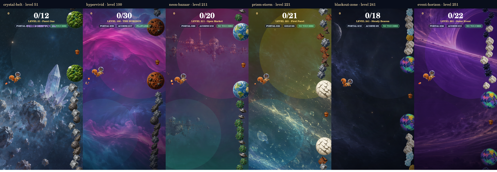

# Zone diversity and reward preview follow-up

Based on main `651efd1`, after PR #180 was merged. The owner identified repeated
backgrounds around 50–60, 90–100, 212–220 and 220–230, and similarity between
the end of Blackout and Event Horizon.

Four of those stretches referenced the same `skies/neon.jpg`. This pass gives
each an original painting and a distinct composition, while retaining the
continuous climbing road, catalog planet/debris families and soft transitions.

| Levels | Zone | New visual identity |
|---|---|---|
| 51–60 | Crystal Belt | Translucent cyan/lavender mineral reefs and faceted silhouettes |
| 91–100 | Hypervivid | Broad organic magenta/cyan cloud ribbons |
| 211–220 | Neon Bazaar | Distant weathered orbital market structures, brass and mint/amber lanterns |
| 221–230 | Prism Storm | Fine diagonal gold/cyan refraction through small scattered fragments |
| 251–260 | Event Horizon | A distant violet/gold gravitational arc with a dark lens silhouette |

Blackout at 241–250 retains its quiet slate-blue painting. Event Horizon now
has a different silhouette and light direction. All five new scenes are
static paintings; they add no flashing, hazards, planets or gameplay mechanics.
Their explicit portrait pans preserve distinguishing forms in tall map crops.

Masters are in `art-src/zone-scenes/`, copied by the export into
`docs/art/zone-scenes/`. Each is 2172 × 724. The built-in image-generation tool
was used; the exact prompt set is in [zone-diversity-prompts.json](zone-diversity-prompts.json).
`zone-visuals.ts` supplies the same painting to map and illustrated flight.
Arcade and Spill retain their own renderers. The art stamp is 177.

## Finding the route and rewards

The normal game and normal beta keep the published 100-mission campaign. In
beta, choose **Star Chart → Explore the Star Map sample**, or use
`/beta/?star-map=sample`. The sample shows 260 positions with the same 30
playable sample missions as PR #180.

The sample's **Reward preview** button opens the proposed 320–780-star ladder.
All 25 entries are also on the sample's climbing reward rail, labeled
**CONCEPT**, and can open the gallery. Rust Runner and Rust Wake use their
existing sample appearance treatments; other Spill appearances/companions
use explicitly labeled stock/Tinbot placeholder art. The gallery has no
purchase, claim or equip actions. Proposed rewards never receive an earned
state, and viewing/closing the gallery must not change the save.

Only the sample shows proposed rewards. Production thresholds, balances,
ownership, mission access, stars and seeds remain unchanged. The original
three barriers remain after 33/66/99 at 2:30/2:00/1:42. Spill mission and endless
behavior are unchanged.

## Review

The existing Star Map regression suite covers production/beta/sample access
and migration. Its menu test now also checks all 25 proposed markers, the
gallery's placeholder labels, and unchanged saved state after viewing it.
The DOM harness records CSS background assignments because happy-dom rejects
valid layered gradient/URL values; browser CSS rendering remains a device check.

The actual flight painters can render these six zones (including the Blackout
comparison) at 320, 390 and 1280 pixels with:

```bash
ACORNAUT_ZONE_REVIEW=51,100,211,221,241,251 node illustrated-src/test-star-map-render.mjs
```

These are native-canvas outputs, not browser screenshots. Browser layout,
touch scrolling and performance still require device review.


