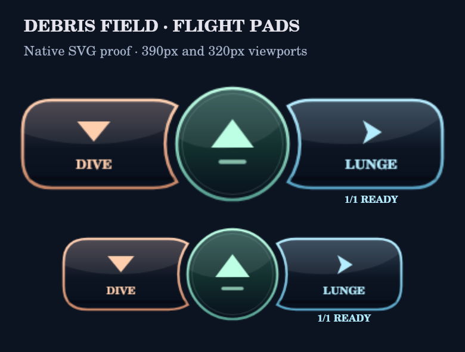

# Debris Field controls and new-run setup

Owner: “they stacked to the right, I wanted high quality buttons in this layout” and “You have to scroll down to start … Maybe just offer the 4 possible upgrades.”

The flight pads now form one centered bottom row: Dive, circular Throttle, Lunge. The wing arcs follow the central circle, and their glyphs and labels are centered in each usable wing. Vector surfaces remain sharp at different widths. Native buttons retain pointer capture, keyboard operation, accessible names, held state and charge feedback.

The entrance is a compact ship preview with a visible Start footer. It has no utility or upgrade picker. After landing, the opening Depot offers only Health, Shields, Thrusters and Pulse; the pilot chooses one free upgrade there as before. The utility shelf first appears at the wave 5 Depot. Earned starting utilities and engine colors remain equipped through Loadout.

The changes were integrated over main's PRs #241 and #242 before final validation; its animation changes are preserved. Build stamp: 246.

## Visual evidence

This image is a native SVG rasterization of the production control helper and geometry, **not a browser screenshot**. The native renderer uses fallback fonts. Reproduce from the repository root with `node illustrated-src/design/debris-controls/render-controls.mjs` after building.

The browser preview was blocked by the environment's access policy. No browser screenshot or browser layout verification is claimed. The intro footer and four-choice flow are covered by DOM integration tests and CSS review; real-device layout remains a validation limitation.

## Verification

The DOM integration test checks the clean entrance, all four opening upgrades, absence of opening utility controls, and all four utilities at the wave 5 Depot. Existing tests continue to cover free purchases, rematches, modal input isolation, saved builds, swaps, and mixed pointer/keyboard controls. The full shipping gates are recorded in the PR.

Docker is unavailable in this workspace. Validation uses workspace-local Node dependencies and the available Python, as allowed by AGENTS.md.
