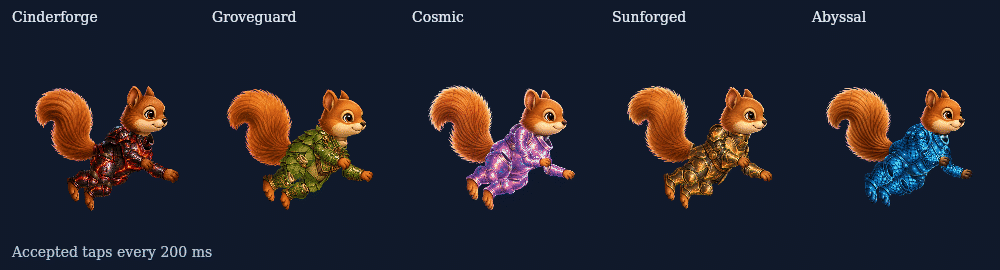
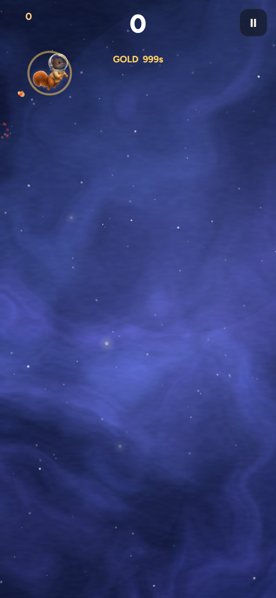
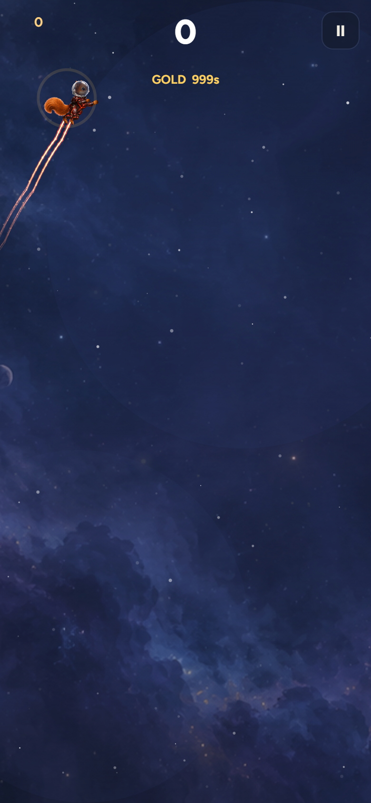

# Flight and High Orbit input response

Fixes #275 and #276. Requested behavior, paraphrased: taps should visibly affect flight animation, and High Orbit should move like AcorNut.

Flight's repeat taps used to reverse a three-frame ascent ramp. At 150 ms intervals the pilot stayed on frame 1; at 300 ms it used only frames 1 and 2 until release. It now completes each gesture and coalesces rapid input into one pending replay. Release drains it; dive/reset clears it. Original frames and helmet anchors are unchanged.

The five High Orbit rigs now retarget AcorNut's Flight locomotion and thrust gesture to their existing anatomy. The tail follows travel and accepted-tap recoil instead of a free-running sine. Short accepted taps visibly move the limbs. Fixed head radius, bone lengths, atlas art, exclusive wakes and premium playback are preserved.

## Focused evidence

- Web/beta, lab, Flight Studio and shell web-package builds and typecheck pass. No lint script; whitespace checked with git diff --check.
- Nine targeted test scripts pass; see validation.json for exact names. New Flight/High Orbit regressions fail on the old behavior and pass on the candidate.
- Flight now reaches frames 1,2,3 while tapping at 150,300, 600 and 1200 ms. At 390x844 DPR 2 the real game renders Flight and all five rigs without page errors or overflow.
- High Orbit steady-velocity tail range falls from 19.30-22.32 degrees to 0; a 40 px/s accepted tap produces 3.41-3.72 degrees of extra hand motion, previously 0. Geometry keeps 36 px heads and constant bones, area-preserving tail strips, no clipping and fully covered joints.
- All 3,600 premium state samples match unchanged main. AcorNut real-flight and A/B physics coverage pass. Shipping art, masters and website are unchanged; only high-orbit-motion.js and sim.js differ after removing cache stamps from generated modules.

The strict High Orbit fallback PNG comparison retains historical Linux Canvas differences. A diagnostic proved candidate fallback pixels exactly equal main for all five and then completed the remaining rig checks. It did not weaken the shipping assertion. Details and metrics are in high-orbit-render.log and high-orbit-regression.json.

Full unrelated harness and global art/helmet suites were not run. This is a desktop browser at mobile dimensions, not an iPhone test. Motion still needs owner visual review; this draft is not merged or released.

| Flight at mobile width | Cinderforge at mobile width |
|---|---|
|  |  |

Tested runtime: `8827b42a7cae96fe4afdaa2a49105d4402fc3942`. The final receipt commit changes documentation and the Studio manifest source-commit field only.
