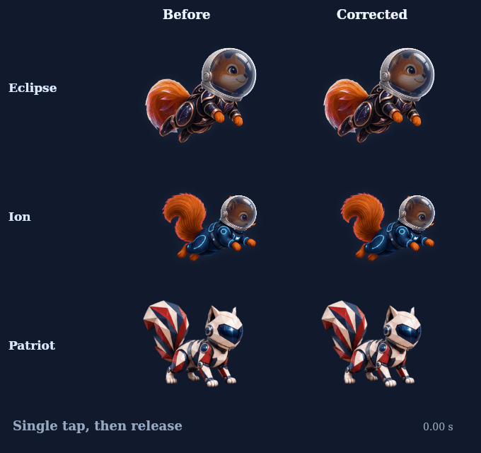

# Tap-bank and High Orbit input response

Fixes #275 and #276. Requested behavior, paraphrased: tap-bank suits including Eclipse and Ion should perform their animation on tap; Patriot should lift sooner; High Orbit should move like AcorNut.

All 24 registered ascent/tap/loop suits now finish their gesture before one bounded replay from repeated accepted input. The previous draft applied this only to the named Flight pilot. Eclipse and Ion reached only 3 of 8 ascent poses at 150 ms taps; they now reach all 8. Ascent playback spends less time near neutral, with every ascent-bank suit showing a changed pose within 100 ms (Eclipse and Ion: first 60 Hz update). Release drains the queue; upward velocity cannot restart a climb, and the three critter banks rest rather than looping on the world clock. Dive/reset clears pending replay. Input forces, pictures and helmet anchors are unchanged.

Patriot has five near-identical opening crouches. Gameplay now uses source frames 1,6–16, reaching the first visible lift at 33 ms and the stronger lift by 100 ms at 30/60/120 Hz. All sixteen original paintings remain intact and individually accessible in the renderer/Studio. Percy and Envoy keep their existing frame sequence. Studio defaults use the same bank priority, repeat policy and Patriot order.

The five High Orbit rigs retain the separately requested AcorNut motion retargeting in this PR. Their input-driven tail and small-tap limb response are unchanged by this follow-up. [Prior High Orbit animation](high-orbit-taps.gif), metrics and fixed-geometry evidence remain in this folder.

## Focused validation

Web/beta, lab, Flight Studio and shell builds and typecheck pass. Ten targeted scripts pass: flight-input, tap-recovery, natural-flight, eclipse-motion-transfer, vanguard, vanguard-flight, platform-bridge, patriot-input, premium-pilots and flight-studio. There is no lint script; git diff --check is used.

The real-painter regression covers 24 suits at four tap cadences (96 traces), settled idle, descent handover, onset, pause and dive/reset. Natural-flight covers 8,640 pose/helmet/size samples. Premium checks cover all 48 original paintings, the selected gameplay sequences at 30/60/120 Hz and retained wake attachment. Live browser checks cover Eclipse, Ion and Patriot at 390×844 DPR 2 with no errors/overflow. Raw results and the exact scope are in validation.json, tap-bank-input.json and patriot-input.json.

The previous five-rig validation is reused because its controller/art/anchors/dependencies did not change. Its historical Linux fallback PNG mismatch remains disclosed; candidate and main fallback pixels were equal. Full unrelated suites were skipped. Native iPhone testing and owner visual acceptance remain outstanding. Nothing is merged or released.
