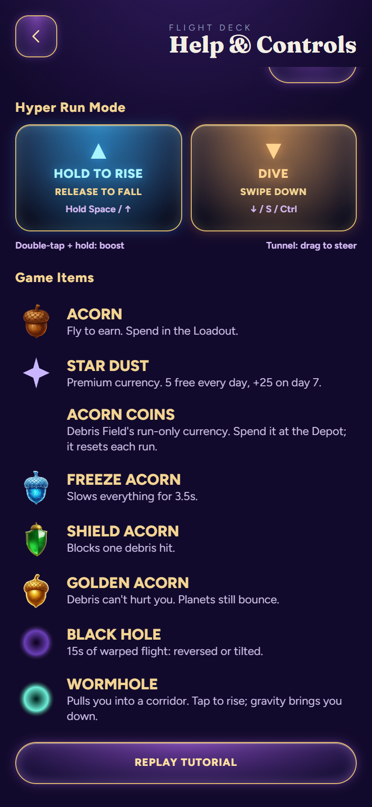
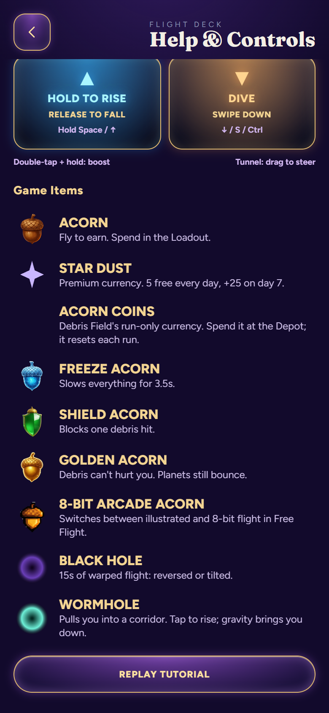

# Arcade acorn in Game Items

Issue #278 corrects a missing reference entry in Help & Controls. The guide now shows the existing 8-bit arcade acorn icon immediately after Golden Acorn, with this description:

> Switches between illustrated and 8-bit flight in Free Flight.

The behavior was checked against the existing retro pickup handling in sim.ts. No gameplay or artwork changes were needed.

## Focused verification

Base: `3a19fe5de460467918243f2b18a3da19b62a420b`.
Tested runtime: `c9a48661b2c396e898d45bbdc75caaf3711ebd13`, web stamp 274.
The following documentation commit does not change the tested runtime.

- On the base build, isolated Edge at 390×844 and 320×844 reproduced the missing entry in both production and beta.
- The corrected builds show nine guide entries, with all eight earlier names and descriptions preserved.
- The new icon has 2,684 nontransparent pixels at DPR 2. Both widths fit with no horizontal overflow or page errors; the production captures were visually inspected.
- Container source export (production/beta), lab build, Flight Studio build and TypeScript check pass.
- All 53 generated game modules were compared with base after stamp/build-time normalization. Only standalone.js has a behavior/content difference: the added Help row.
- Shipping artwork, masters, website, physics, spawning and saves are unchanged. The exporter retains recent cache stamps and prunes js270 according to its existing four-stamp policy.
- git diff --check passes. No lint script exists.
- Full gameplay harness, global art gate and platform bridge checks were intentionally skipped for this static Help-only addition. No unit test was added merely to repeat the string. The already documented unrelated High Orbit Linux raster issue was not rerun.
- Native iPhone and live deployment are unverified. A pre-existing blank Acorn Coins icon in these isolated captures is unchanged by this patch; the new arcade icon is verified separately.

## Browser reproduction

Use a fresh isolated browser context with a synthetic completed-tutorial save. Start the local production or beta build, open **Help and controls**, and scroll to **Game Items**. Confirm the arcade row, its icon and description. At 390px and 320px, confirm the list has no horizontal overflow.

[Before measurements](before.json) · [After measurements](after.json) · [Scope receipt](scope.json)

| Before, 390px | After, 390px |
| --- | --- |
|  |  |

[After at 320px](after-production-320.png) · [Beta at 390px](after-beta-390.png) · [Beta at 320px](after-beta-320.png)

Draft for owner review. No merge or release performed.
