# Loadout appearance review

These are actual browser captures from an isolated test profile with synthetic
equipment ownership. Player saves and the installed game were not accessed.
The supplied reference image guides appearance only; every item, caption and
control shown here comes from the existing game.

The baseline now includes premium pilot PR252, merged at
`d296e6bc404aaec14221a8b79186132fb4426dea`. The loadout is rebuilt as256.

| Before | Neon galaxy loadout |
| --- | --- |
| 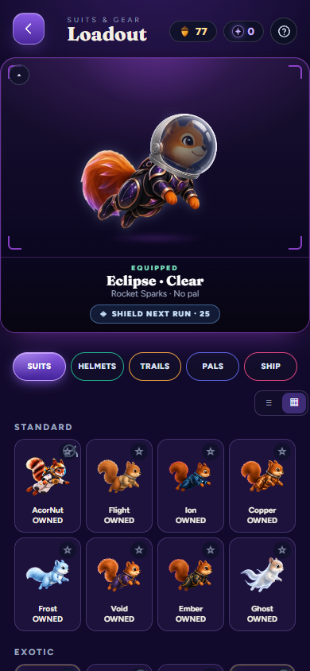 | 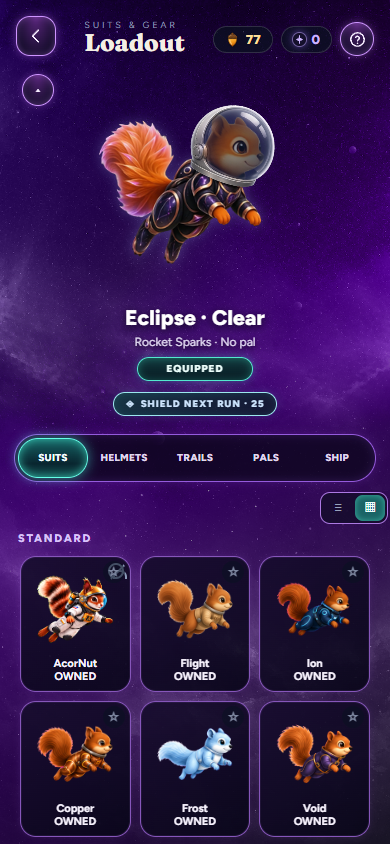 |

| Verdant | Cryostar | Copper |
| --- | --- | --- |
| 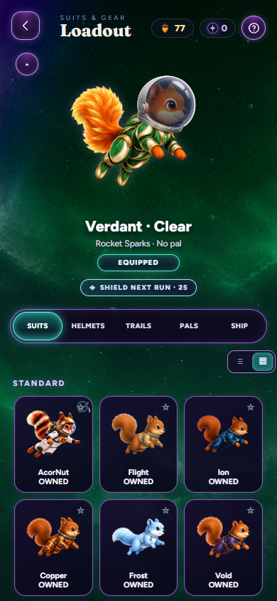 | 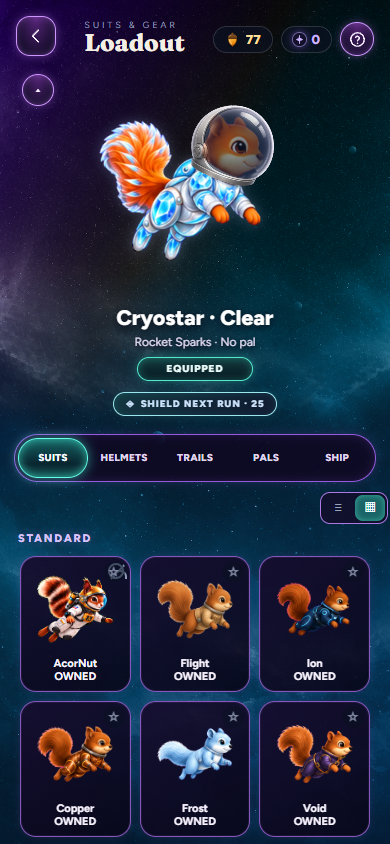 | 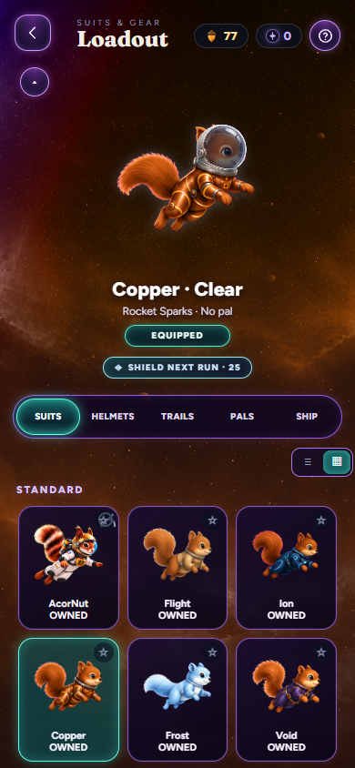 |

The newly merged pilots are preserved and work in the updated loadout:

| Porcelain Paragon | Nacre Envoy | Foldspace Origamist |
| --- | --- | --- |
| 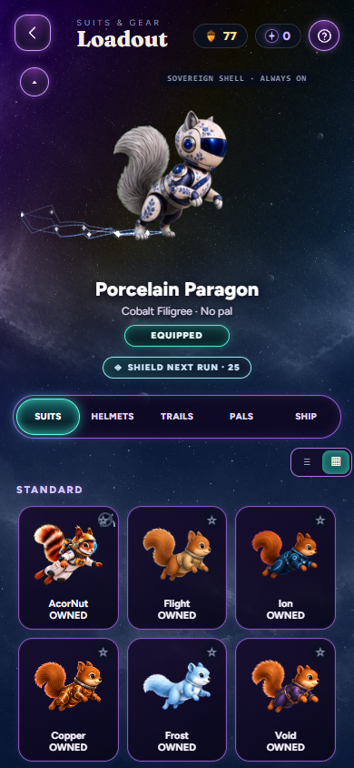 | 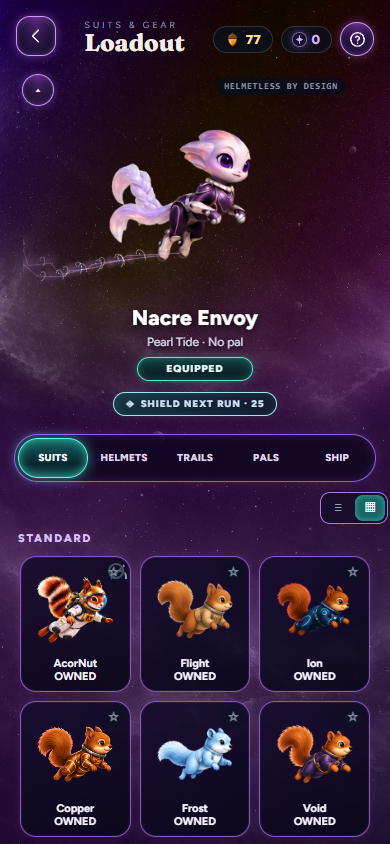 | 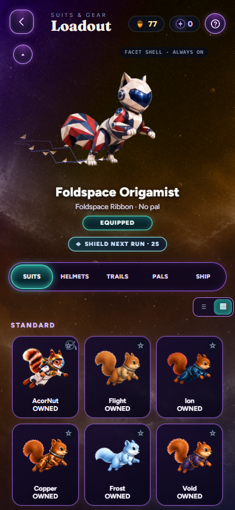 |

The equipped suit colors the nebula artwork around the live preview. Cyan
marks selection; violet frames the existing tabs and controls. Owned premium
cards keep gold styling. The old stage border, corner brackets, spotlight,
pedestal and opaque nameplate no longer appear in the loadout.

The five existing tabs remain **Suits, Helmets, Trails, Pals and Ship**. The
existing fold gesture/button, equipment details, favorites, shelf/grid
selector, prices, ownership and shop link remain. No bottom tab bar is added.
Compact mode still follows the saved preference. Three columns and larger
portrait canvases give the existing artwork more space without changing it.

| Compact preview | Short phone |
| --- | --- |
| 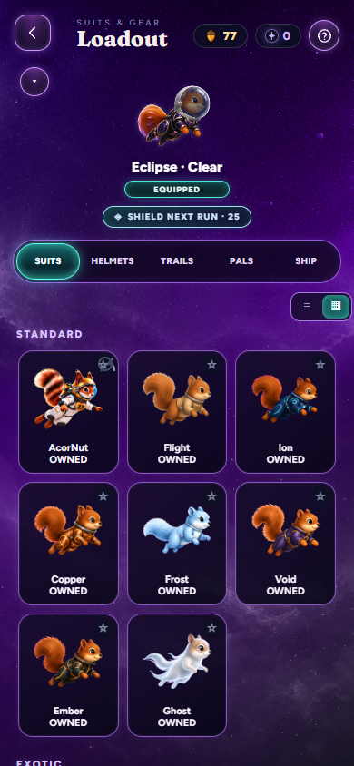 | 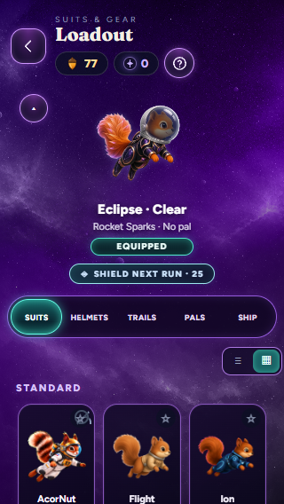 |

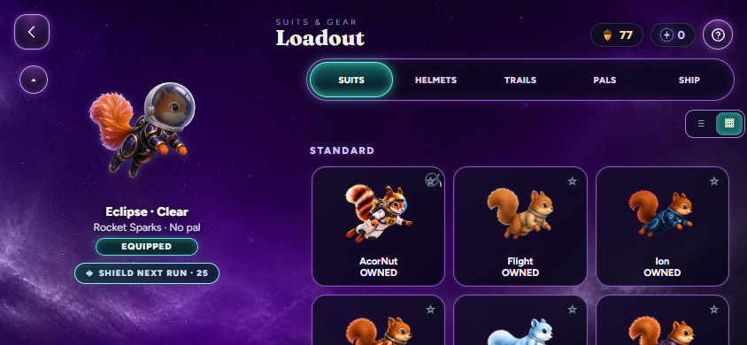

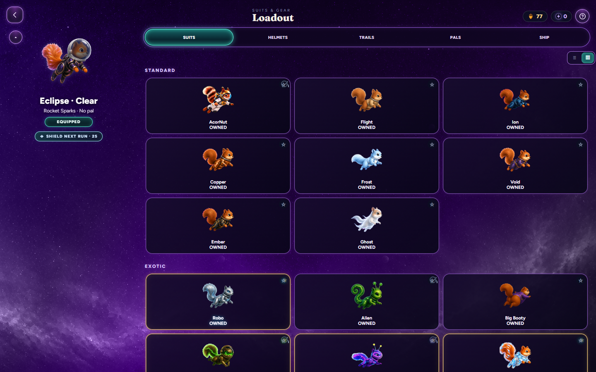

See [README](README.md) for implementation boundaries and
[browser verification](browser-verification.json) for measured layouts,
existing-control interactions and browser error results.
