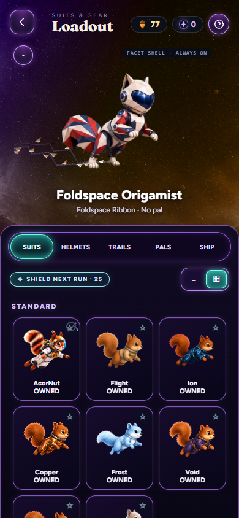
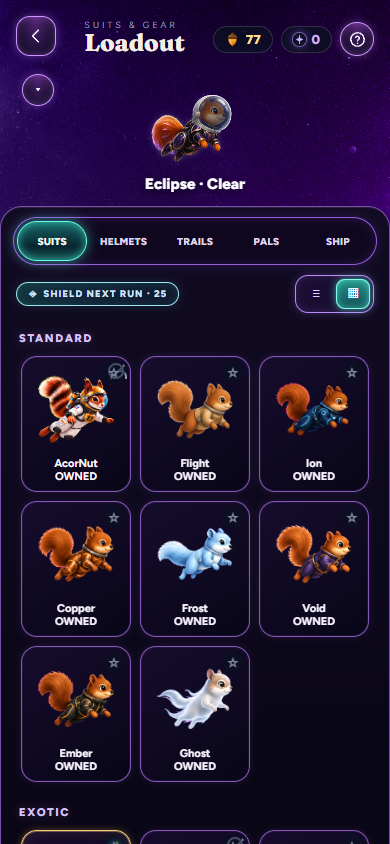
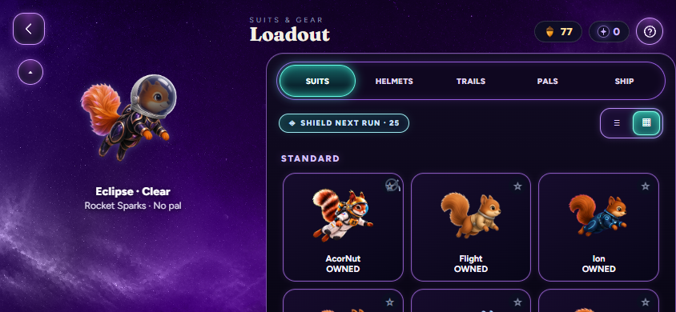

# Approved screenshot revision, 9 September 2026

The owner reviewed this revision in chat and authorized merging PR255 on
9 September 2026. These are the final screenshots for the loadout change;
captures in the parent directory document the earlier design iteration.

The hero's redundant EQUIPPED caption is removed; the selected card retains
its existing state. The existing next-run shield action and armed state now
sit beside the existing shelf/grid toggle. The toggle has stronger cyan and
violet lighting. A fully opaque dark selection surface separates browsing
from the suit-colored galaxy around the live pilot.

Existing suits, tabs and action handlers are retained. Semantic comparison
with merged main ignores only the shield's explicitly requested change in
DOM order. The updated preview is checked with source export/lab build,
TypeScript, bundle/platform checks and 34 browser checks, with zero page
errors or failed art responses. The complete catalog and all existing
control handlers match the merged main baseline. The final full test and
art gate results are recorded in the parent [README](../README.md).

