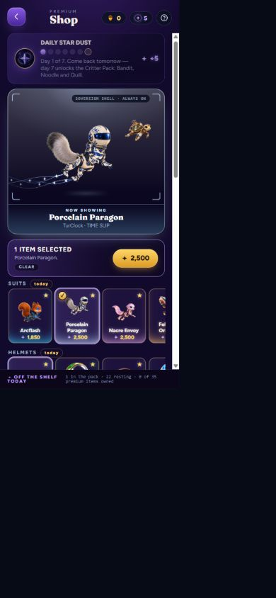
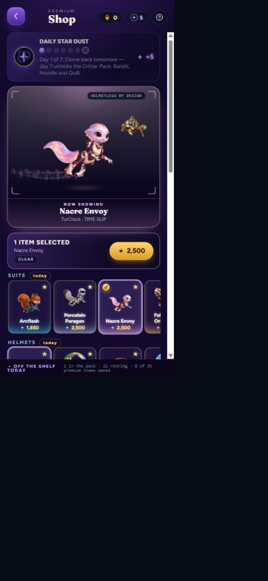
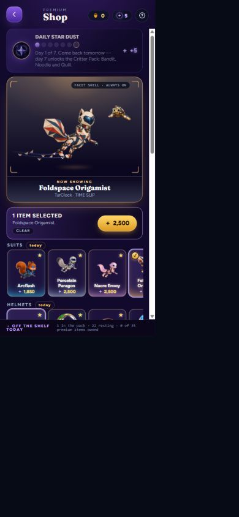

# Premium pilot validation — 9 September 2026

The three selected kits are implemented with their required head designs and
2,500 Stardust prices. The PR remains a draft because the repository-wide
release gate has one independently reproduced baseline failure.

## Passing checks

- Source export, lab build and Flight Studio build at art stamp 252.
- Complete game/lab TypeScript no-emit check; `git diff --check`; platform
  bridge check across 46 source files. This repository has no lint script.
- All 32 groups in `verify-art.py`, including decoding 1,464 raster assets,
  runtime dimensions, catalog/load matching and the existing anatomy checks.
- Premium render, production and beta integration checks: exactly 2,500
  Stardust per kit, real Shop/cart and bundle transactions, save/reload,
  restoration of the previous helmet, fixed heads across all 30 helmets,
  included exclusive wakes, ordinary flight and Hyper Run authority.
- For each new rig: 960 controller ticks, 80 painted motion samples, constant
  bones/head scale, covered joints, no clipped body or detached limb, clear
  head/tail separation, plus 720 strict browser-compatible wake samples.
  [The render receipt](regression.json) holds the measured values.
- Flight Studio loads 34 models, including the three new rigs, and validates
  its 10 articulated models and generated source/asset hashes.

Docker Desktop's engine was unavailable. Checks used existing Node 24.19.0,
TypeScript, happy-dom, canvas 0.1.100, and a pre-existing Python environment
with Pillow 11.3.0, NumPy 2.1.2 and SciPy 1.17.1. Nothing was installed.

## Complete suite and inherited failure

`node illustrated-src/run-tests.mjs` finished with **49 passed, 1 failed,
0 skipped, of 50**. The sole failure is `test-arcflash-render.mjs`'s exact
comparison between the existing Arcflash fallback PNG and live rig render.
At 256x256 it reports 25 differing pixels across 28 channel bytes, maximum
channel delta 3, with one alpha mismatch.

An independent archive of main **85f30e60b8b7568cdd911a9cf888122b47833d83**
reproduced the same failure. Baseline and PR have identical Arcflash atlas,
fallback PNG, live-render RGBA and fallback-render RGBA SHA-256 hashes in
[the comparison receipt](arcflash-baseline-comparison.json). The cause is
not established by that equivalence. The Arcflash artwork and assertion
have not been changed or relaxed in this PR.

The historical helmet comparison passed after hydrating its pinned Git
objects. Windows-only import/compiler launch failures were corrected in the
runner and two Spill tests; no tests were skipped. The remaining Arcflash
failure still needs resolution or an explicit owner exception before release.

## Browser review

The actual production page was opened in the in-app Chromium browser and its
Shop tested at a measured 390x844 CSS viewport. Each new card showed 2,500
Stardust, selected its own animated painting and displayed the required head
label. No console errors or warnings were observed on that page. These are
uncropped browser captures, including the browser's surrounding dark area:

| Porcelain | Nacre | Origamist |
|---|---|---|
|  |  |  |

The interactive lab was separately inspected with dark and light backdrops,
continuous motion and the new wakes. A browser-discovered negative Nacre
ellipse at particle expiry was repaired and given a strict regression check.
The retained [pose contact](pose-review.png) and [production contact](production-review.png)
use the shipping renderer; those two contacts are generated render receipts,
not browser screenshots. Concept fidelity and readability were reviewed at
192px and 52px references; owner approval of the final appearance is separate.
