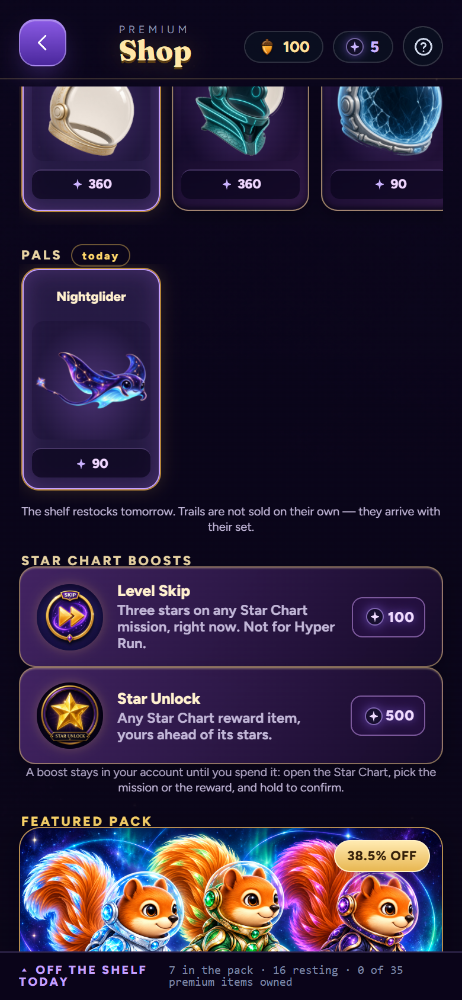
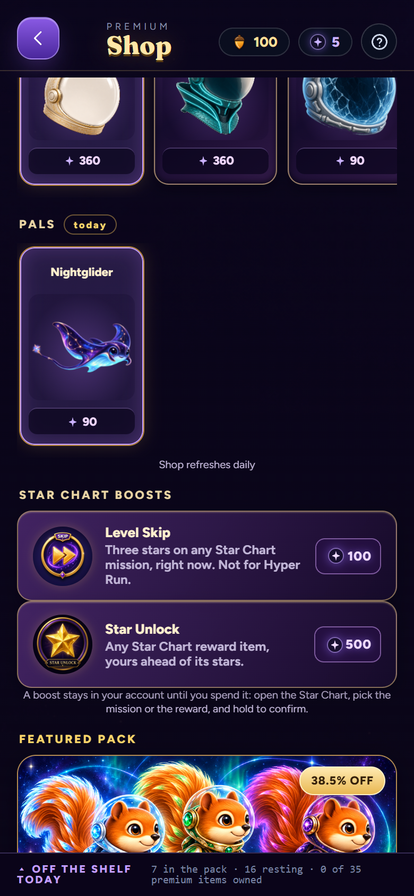
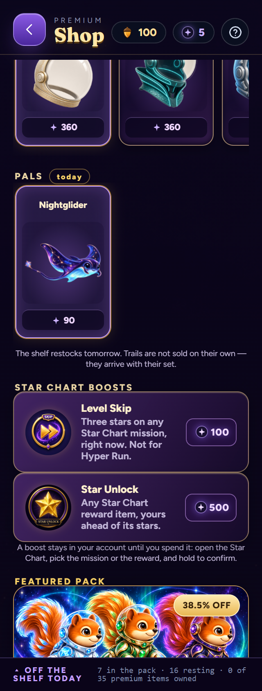
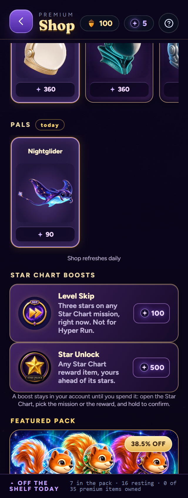

# Shop refresh copy

Issue #267: the note below the daily shelves overexplained restocking and trail availability. It now reads **Shop refreshes daily**, in the same location. The source change is one string in standalone.ts; rotation, offers, prices, purchases, saves and art are unchanged.

Current main 944578e8223883352bac168cb8a843caa1b70194 is integrated, including the merged helmets, Shop spacing and website showcase. Production/beta, lab and Flight Studio outputs were rebuilt in the existing container at stamp 270.

## Focused verification

Runtime tested: 6ec3d942296682e9030532451347b4a0bb952135. A subsequent website-only main update was integrated without changing the tested game source or outputs. Only four website files changed upstream; game checks were not repeated. The final receipt commit changes only this review folder.

- Container builds pass. Compilation is part of the export.
- Fresh isolated Edge at 390x844 and 320x844, DPR 2, passes in production and beta. The new note fits one line (13px), with no page errors or horizontal overflow. Both production captures were visually inspected.
- The original reproduction on main daad832/build 265 occupied two lines (26px). At a fixed inventory clock, offer IDs and displayed prices match that baseline in both production and beta.
- Scope comparison checks all 51 generated game modules: only the note, stamp and build time differ from current main. Shipping artwork, source masters, website files and Shop CSS are unchanged.
- git diff --check passes. There is no lint script. The full gameplay harness, global art gate and platform bridge were intentionally not repeated for this wording-only change, following the scoped verification policy. No unit test was added merely to repeat the static string.
- The unrelated Linux Canvas High Orbit raster limitation already recorded in PR266 was not rerun. Native iPhone validation has not been performed.

[Validation receipt](validation.json) / [Original measurements](before-measurements.json) / [Current production](after-measurements.json) / [Current beta](beta-after-measurements.json).

| Before | After |
| --- | --- |
|  |  |
|  |  |

Draft for review. No merge or release performed.
