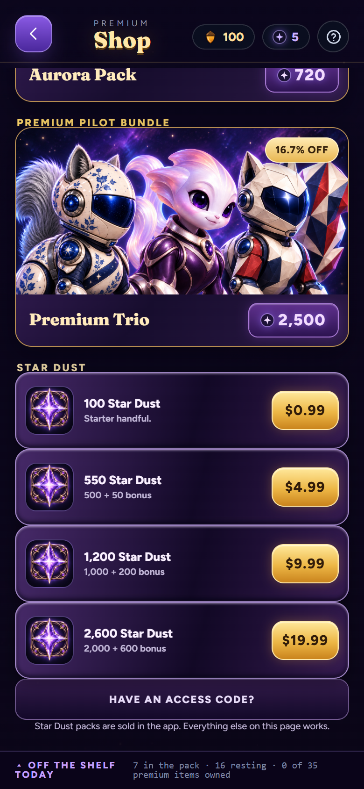
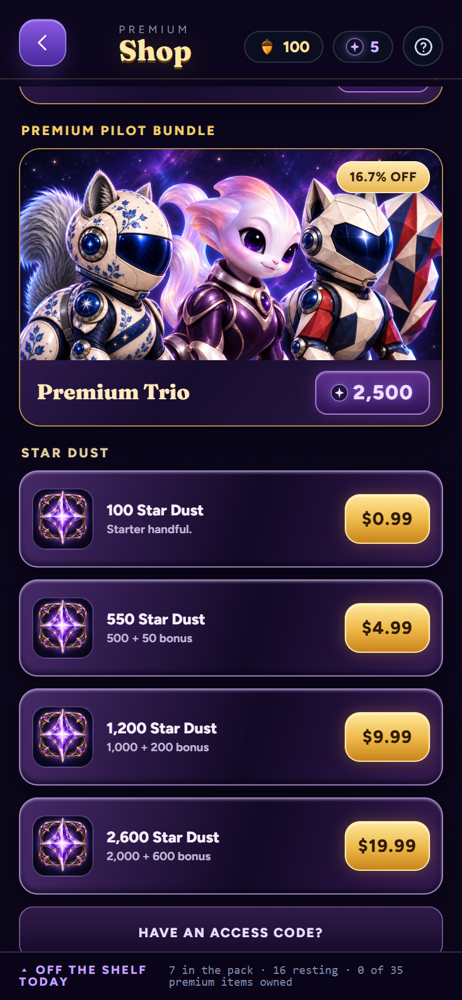
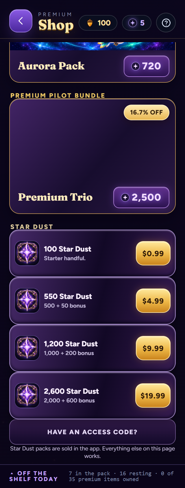
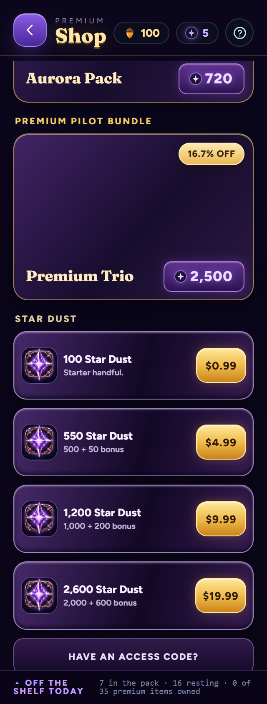

# Shop spacing repair

Issue #265 covers the shared Shop spacing reports. The section headings inherited a -2px lower margin and adjacent Stardust purchase cards had no separation. Text already contained the space in Star Dust.

Two Shop-only CSS rules now give headings 8px clearance and purchase cards a 10px lower margin. Prices, text, handlers, ownership and artwork are unchanged. Source export generated production/beta/lab/Studio at stamp 264; pending visor work uses 263 on a separate branch.

## Evidence

Fresh disposable Edge contexts at 390x844 and 320x844 reproduce -2px heading gaps and 0px card gaps on main 11a1b88df55ab0664fc413cb07a384ae15e3e704. The candidate measures 8px and 10px respectively, with no horizontal overflow or page errors. The geometry assertions fail on the recorded baseline and pass on the candidate. These are desktop browser tests at mobile widths, not native iPhone validation.

[Before measurements](before-measurements.json) / [After measurements](after-measurements.json).

| Before | Candidate |
| --- | --- |
|  |  |
|  |  |
|  |  |

## Repeat the layout check

Use existing Playwright and browser tooling; do not install host packages. Point ACORNAUT_PLAYWRIGHT at the existing Playwright package and ACORNAUT_BROWSER at an existing Chromium/Edge executable, then run:

```sh
node illustrated-src/design/shop-spacing/browser-check.mjs after
```

The check serves only this checkout on a temporary loopback port, opens isolated browser storage, measures both widths, asserts the gaps/overflow/page errors and closes its browser/server. Set ACORNAUT_REVIEW_BETA=1 to check beta, and ACORNAUT_REVIEW_OUTPUT to write captures outside the repo. The before mode captures baseline geometry without enforcing the repaired distances. This optional browser check is separate from the standard dependency-limited Node harness.

## Shipping status

Container builds/typecheck/art/harness/bridge have been attempted. Final gate results and any blocker are recorded in validation.json. Do not interpret visual success as release approval.

The complete Docker harness finished with 55/56 passing, one failure and no skips. The failure matches the previously reproduced unchanged-base High Orbit raster difference exactly. Production and beta layout assertions pass at both widths. This candidate remains local under the scheduled workflow's requirement for green shipping gates before publication.
