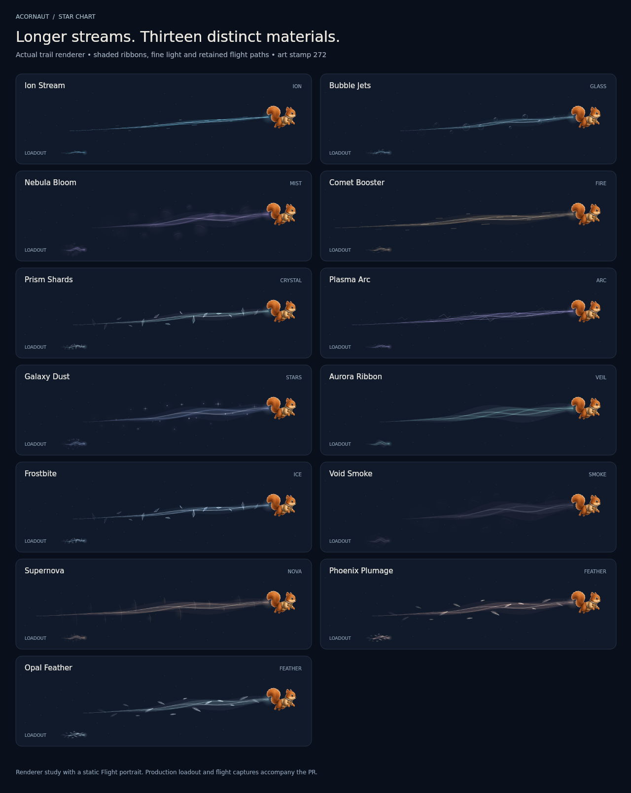
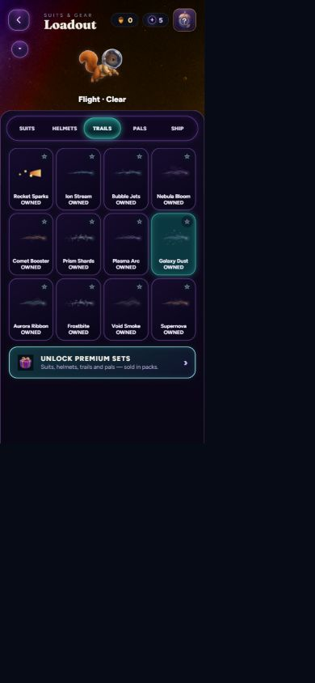
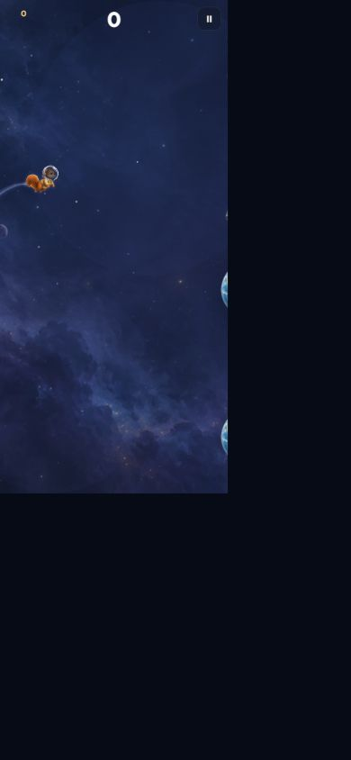

# Star Chart trail refresh

The equipable Star Chart reward trails now retain the pilot's curved flight
path for 1.45 seconds. They replace intermittent particle bursts with tapered
translucent streams, shaded color families and sparse material details.
Arcflash's 0.48-second retained wake was the length reference. Arcflash,
AcorNut and High Orbit retain their exclusive, nozzle-driven wakes.

| Reward | Material treatment |
| --- | --- |
| Ion Stream | Ice-blue filaments and fine ion streaks |
| Bubble Jets | Transparent glass beads with curved highlights |
| Nebula Bloom | Mauve vapor, overlapping wisps and soft scattering |
| Comet Booster | Champagne core, copper envelope and drifting embers |
| Prism Shards | Translucent mint/rose facets with pearly edges |
| Plasma Arc | Lavender filaments and softly evolving electrical forks |
| Galaxy Dust | Indigo haze, warm pinpoint stars and sparse glints |
| Aurora Ribbon | Layered jade/lilac veils following the flight curve |
| Frostbite | Icy filaments and thin, beveled crystals |
| Void Smoke | Dark translucent vapor with restrained silver-lilac edges |
| Supernova | Warm flowing envelope with expanding curved shock fronts |
| Phoenix Plumage | Copper/rose feather forms with fine quills and barbs |
| Opal Feather | Pearly mint/silver feathers with the same fine structure |

## Implementation

`game/star-trails.ts` owns presentation-only history and rendering. Samples
are interpolated at 60 Hz, capped at 90, and stored outside the simulation
in a weak map keyed by the current world. The renderer combines scroll
distance with exhaust drift. Taps brighten the source; previously emitted
points keep their position when the pilot climbs, dives or banks.

The history clears on a new trail, backwards clock, teleport, resize/scale
change or a rendering gap over 0.25 seconds. Death stops emission and the
existing trail fades out. Pause and completed-level overlays freeze the
history and its animation phase. Resume translates sample timestamps so
the stream does not age away while the menu is open.

The same painter supplies live illustrated flight, the retro transition and
loadout/reward cards. Card samples are complete on their first paint.
`spawnTrail` skips the old particle emitters for these 13 IDs, just as it
already does for suit-exclusive wakes. No extra gameplay randomness,
image downloads, unlock changes, prices or save fields are introduced.

There are at most 26 small material motifs per trail and two or three fine
filaments. Glow uses small gradients, with no canvas shadow blur. Smoke
uses normal alpha compositing; luminous materials use additive light.
The viewport naturally clips a long tail at the screen edge; pilot/camera
placement is unchanged.

## Review evidence

Base: `830d2bc9dc1d7fc83a493d1a01db3cf112182a53`; generated art stamp: 272.

The gallery is an isolated rendering study using the actual stream and
card painters with a static Flight portrait. It is not a screenshot of
gameplay. These are browser captures of the production app at a 390x844
viewport using an in-memory fixture save:

## Verification

- Source export and lab build; TypeScript no-emit check.
- `verify-art.py`: 32 groups pass. Its pre-existing 14 frame-spread flags
  concern unchanged suit frames.
- Platform bridge: 53 source files clean. Checkouts must use LF; CRLF can
  make the bridge regex misread line comments.
- `test-star-trails.mjs`: all 13 reward IDs, 30/60/144 Hz retained paths,
  bounded history, repeated paints, trail changes, teleport/resize/reset,
  crash decay, raster coverage, distinct first-paint cards, canvas-state
  restoration, no simulation RNG/particles, and pause/resume phase.
- Complete harness: 59 tests attempted, none skipped. Initial run: 56 pass,
  3 fail. After fetching both pinned helmet references and normalizing
  checkout line endings, helmet-animation and Hyper Run pass on rerun:
  58 pass overall, with the one baseline failure below. The final trail
  pause-phase adjustment also passes its focused raster/behavior checks.

Known baseline failure in the existing Docker rendering environment:
`test-high-orbit.mjs` reports that Cinderforge's fallback differs from its
rig by 22 of 262,144 bytes (maximum channel delta 28, first byte 64,900).
The identical failure was reproduced using unmodified main modules and
the same unchanged art. This trail change does not repair that separate
fallback image discrepancy.
