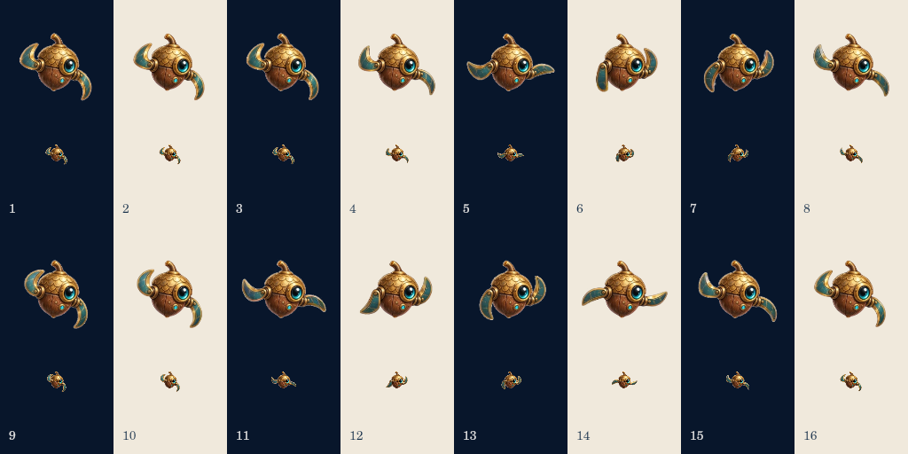

# Switchback companion review

Switchback uses the owner's supplied 4×4 sprite sheet, with all 16 poses in
row-major order at the existing pal cadence of 12 fps. The original JPEG is
retained in `art-src/pals/switchback/owner-sheet.jpeg`. The deterministic
`export-switchback.mjs` packer removes edge-connected white backing and uses
one scale and offset for every 256px frame. The production painter retains
that registration instead of resizing each fin silhouette. Frame 1 is the
exact still fallback; an incomplete bank keeps the still and can retry.

Switchback is cosmetic only. Tapping never changes scrolling direction,
either equipped in free flight or authored into beta missions 44/104/164/224.
Those missions retain their identity, seeds, goal bits and earned credit.
The UI now describes the companion as cosmetic.

Both builds use the existing premium ownership and rotating store paths:
90 Star Dust individually or the companion pack, with the store's normal
featured discount. Fresh beta saves also use this gate. Recorded ownership
from the earlier beta is grandfathered into purchased ownership on load;
no owned pal or other earned reward is taken away. Mission appearances do
not grant ownership. There is no new billing integration.

Build 183 incorporates main's merged Spill welcome/coin changes (#185).
The immutable 182 snapshot is preserved; export retains 180–183.

## Verification

- TypeScript export and generated roadmap.
- `test-switchback.mjs`: real engine/store in production and beta; fresh gate,
  insufficient/exact payment, duplicate purchase, equip/save, earlier ownership,
  and tick-for-tick cosmetic flight against solo.
- `test-switchback-render.mjs`: real native-canvas preview painter, 16 lazy
  frames, partial-load failure/retry, frame ordering, fixed scale and fallback.
- Star Map simulation and UI in production/beta/sample; all 260 beta completion
  seams; unchanged goal credit, seed and three-barrier checks.
- Spill rule/welcome/progression/UI checks and Vanguard regression checks.
- Full shipping art audit: all 30 groups pass, including the previously invalid
  Switchback still size. Existing suit frame-spread observations remain listed.

Native-canvas review below shows each pose at 100px and 30px against light and
dark backgrounds. This is not mobile-browser or real-device performance QA.

