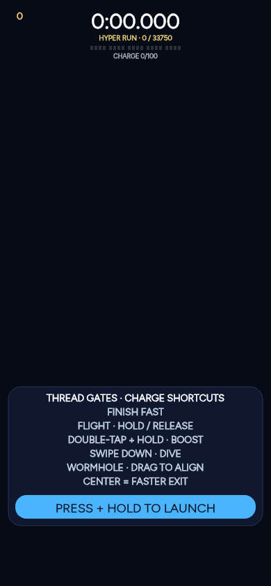
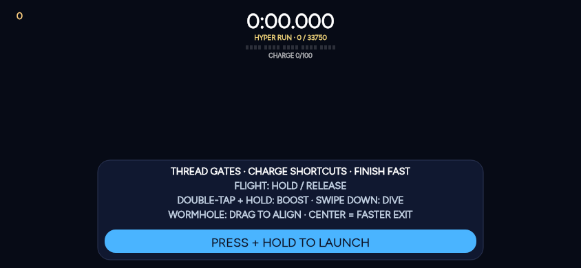

# UI harmony implementation

Implements the agreed A–C scope in [proposal PR #238](https://github.com/j6sistek-ui/AcornautSandbox/pull/238), against main at `c580309`. Production and beta use stamp **243**.

## Changes and refinements

| Scope | Implementation |
| --- | --- |
| A · Shared chrome | Depot and new-run actions compose the hub's blue primary and dark secondary classes. Shared orange kickers, Fraunces 800 titles, uppercase action labels and `?` help controls replace local overrides. Hyper briefing uses the purple back control, a help control that focuses its existing instructions, and a sticky blue start action. Its canvas READY panel matches the same material and type. |
| A · Selected choices | Saved starting utilities, engine colors and SHIP previews use `.on` with shared violet tokens. Functional hardpoints, live Depot fitted utilities, gold spending cues and flight controls keep their existing meanings. |
| B · Copy and Help | Acorn Coins is consistent across Help, pause, setup, guide, prices, contracts, utility descriptions and accessible labels. Fieldbreaker replaces the leftover mastery name. Guide utility labels come from `SPILL_UTILITIES`. |
| B · Replay and mode awareness | A shared HOW TO FLY · DEBRIS FIELD section appears alongside the planet instructions and moves first when Debris Field is selected. Settings & Help and new-run setup can replay the briefing. Replaying is read-only, preserves the first-visit guide and restores focus on close. The modal blocks Space from launching the ship behind it. |
| C · Clipping | SHIP's landscape grid has bounded rows and a shrinking scroll area instead of a preview spanning 97 implicit rows. Safe bottom padding and wrapping price labels keep the final content reachable. New-run setup has safe top/bottom bounds, extra title padding and non-shrinking content. |

The three Help currencies are grouped before temporary pickups. Hyper Run retains its race/time instructions and existing launch action; it receives no Depot or wave instructions.

## Scope boundaries

This change leaves flight physics, Throttle/Dive/Lunge layout and tints, the pending dual-fall teaching work, Depot cadence, free utilities, economy rules, Normal flight controls, hangar art and the Modes tile hue as they were on main. Main already says OUT OF HEALTH; that existing receipt wording is preserved without further edits.

## Verification

- Build/export, typecheck, all 30 art QA groups and the platform bridge check passed. The final bundle gate confirms 39 matching, resolvable modules at stamp 243.
- **42/42 test scripts have passing results; none skipped.** The full harness was interrupted: 36 scripts had passed, and the Star Chart harness needed the compatibility corrections below. That corrected harness passed in production, beta and sample modes. The five remaining scripts (Vanguard render, rig and navigation, Warp, and wormhole trip) passed in recovery runs. A fresh full-wrapper attempt also lost its execution-service connection after typecheck and art QA, so this record does not claim one uninterrupted `npm run gates` completion.
- Added coverage for read-only briefing replay, focus return, keyboard input isolation, Help currency ordering, both Hyper briefing return paths and the original held launch in production, beta and sample modes.
- The bundle gate compares the stamped modules with the fallback, checks browser-resolvable imports, and checks both page loaders.
- Fixed two existing happy-dom compatibility problems in the Star Chart harness without dropping its checks: literal `?` in an attribute selector and truncated layered CSS backgrounds.
- Native canvas READY HUD renders have all labels within bounds at 320×568, 390×844 and 844×390. These exercise the actual HUD painter but are **not browser screenshots** and do not establish CSS layout correctness.

## Required before merge

The browser security policy rejected the game preview. The 390-wide browser proof and changed-screen screenshots required by `SHIPPING.md` could not be completed. This implementation must remain draft until that visual review passes.

At 390×844 and 844×390, review and capture:

1. Home → Modes → Debris Field → Launch: title, selected starter/color, all actions; open and close the `?` briefing.
2. Land → first-visit guide → Depot → free upgrade → Launch wave; pause and results.
3. Loadout → SHIP: scroll to the last section and check bottom content/focus rings, especially in landscape.
4. Settings & Help: both flight instruction blocks, the currency cluster, briefing replay and return focus.
5. Modes → Hyper Run → briefing → READY; also open and close the briefing from a cleared Star Chart barrier. Check purple back, blue primary, title and instruction legibility.

Native HUD-only review images:

[320×568 HUD render](hyper-ready-hud-320.png)
