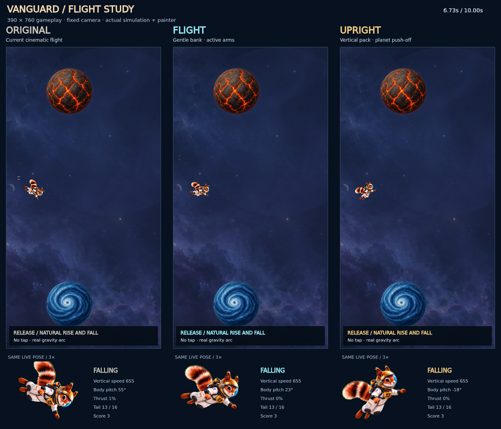

# Previous review: Vanguard flight rig (PR #195)

Historical evidence for the second flight review. The current separated-part
revision is documented in [README.md](README.md). Measurements and clips below
describe the older flattened-art rig, which remains the missing-atlas fallback.

The owner reported that the tail worked but Vanguard dove forward too much,
held his arms still, and read as Superman. The previous body was deliberately
fixed in every tail drawing. Its +34° art correction plus +22° gravity heading
could rotate the whole drawing about 56°, pointing the face and hands down.

The first review improved posture but moved the paws less than one screen
pixel during rapid taps, so the owner correctly saw mostly a tilt change.
This revision adds broader, staggered arm and knee articulation to both new
flight styles while keeping the original drawn tail.

[Flight comparison](Vanguard-Flight-Comparison.mp4) · [Planet push-off](Vanguard-Planet-Push-Off.mp4)

[First review vs organic limbs — fixed tilt and tail](Vanguard-Organic-Motion.mp4)



| Beta option | Behavior |
| --- | --- |
| Flight | Relaxed cruising posture; independent arm/hand drift, rising tuck and falling release; restrained body pitch and smooth thrust. New default. |
| Upright | Taller jetpack posture, a more pronounced planet compression/push-off, and a modest forward tip in descent. |
| Cinematic | Original whole-character motion, retained for comparison. |
| Continuous | Original faster tail/heading response, retained for comparison. |

Select Vanguard, then use **Hangar → Suits → Vanguard Motion** or the same
picker while paused. All four choices persist in beta. Production uses Flight;
experimental saved choices cannot change production behavior. Ownership stays
at 500 earned stars in production and open in beta.

## Motion design

Normal flight reaches its apex about 346 ms after a tap (−450 velocity, 1300
gravity). A whole-body jump cannot finish gracefully on every short input.

- The 1.8-second tail clock never rewinds or pauses on taps. Existing 16
  registered tail drawings and their fixed helmet scale remain in use.
- Body heading follows vertical velocity. Arms follow a slow 2.15-second
  float with offset timing; knees settle on a separate 2.65-second cycle.
  Shoulder, elbow and wrist influence carries the paws through loose arcs,
  while the feet tuck and trail. Damped, speed-limited joints carry this
  motion through rapid taps without restarting it. No random noise or camera
  shake is added.
- Accepted tap acceleration sets a short pressure envelope. Arresting a fall
  gives a stronger jetpack response than refreshing upward travel. Joints
  ease toward it rather than replaying a squat or snapping to a keyframe.
- Contact has a separate compression, push-off and settle response. It survives
  an immediate next tap. Its dust remains on the contacted planet surface.
- Both new postures use angular inertia and explicit speed limits, including
  recovery from a swipe and switching between the new styles mid-run.
- The exhaust uses attached nozzles, a white core, cyan flow and warm outer
  falloff. It breathes smoothly and does not generate random particle bursts.
- Forces, collision circles, input timing, scores, random seeds, other suits,
  ship flight and Vanguard's separate Depot gag are unchanged.

## Artwork and implementation

The original masters and registered tail export remain in `art-src/vanguard`.
This change adds no raster frames. `vanguard-rig.ts` articulates localized limb
regions at draw time; the existing tail drawing and helmet remain rigid inside
the character. The near hand has more chest-side room to articulate. A
continuous triangle-area limit prevents mesh folding without abruptly
shrinking the pose at a threshold. Joint limits protect the suit silhouette.
Two bounded cached surfaces per
active state (192px gameplay / 512px close-up) refresh limbs at up to 30Hz,
with immediate tail-frame updates; outer body pitch stays at display cadence. The face is never
scaled independently, and there is no crossfade between duplicate characters.

`vanguard.ts` owns the visual state only. Its substepped damped joints do not
feed the simulation. `sim.ts` passes the already-accepted velocity change into
the thrust response, retaining the exact existing force assignments.

## Review evidence

The comparison renderer uses the real simulation and world painter at
390 × 760. Original Cinematic, Flight and Upright receive identical inputs.
The primary clip uses ordinary short arcs and 100/180/300 ms tap bursts with
no following camera or position resets. A separate, labeled tall chamber
checks actual planet contact followed by a tap, with a following review camera.

The six-second organic comparison holds body tilt, tail frame and exhaust
fixed in display copies of live simulation states. The left side is commit
`5c44e92` (the rejected first review); the right side uses the revised motion.
Both receive the same accepted 100/180/300 ms tap groups and identical
velocity inputs. The game-size copies use the same joints as the close-ups.
This diagnostic view isolates articulation; the other clips show full motion.

The raster test tracks each connected orange paw with tilt, tail and exhaust
fixed. During sustained 100/180/300 ms taps, the near glove travels about
2.45 gameplay pixels, the far glove 3.19, and the near foot 1.8–1.9. The
near glove previously moved only 0.31–0.39 pixels. Its initial 3px visual
goal remains unmet: pushing farther distorted the flattened suit boundary.
The regression minimum is therefore 2.3px and 5× the baseline for that hand;
the 3px diagnostic goal stays visible in the report. Larger near-arm gestures
would benefit from separately painted arm and background layers. Far-hand
and foot minima remain 3px and 1.5px. This is a deliberate silhouette limit,
not a claim that the initial near-hand goal passed.

Validation covers tick-for-tick gameplay equality, independent limb motion,
non-restarting taps, bounded angular speed, contact recovery, 30/60/120 Hz
controller consistency, ownership, saved selection, pause/resume, fallback art,
and the separate Depot sequence. Native-canvas playback is not a Safari/device
performance recording. Final appearance and phone frame pacing need owner
playtesting; these remain comparison options rather than a claim of final polish.

Measured native CPU cost includes the first draw after each 60Hz simulation
step, so texture refreshes are counted. This is heavier than the original:
roughly 5.5–5.9 ms median and 6.5–6.9 ms p95 for the new styles in this run,
versus about 0.10 / 0.15 ms for Original. Cache hits are cheap; refreshes
account for the cost. These are isolated painter measurements at gameplay
size and 3× pixel density, not device frame-rate claims. The original styles
remain available for phone comparison. `review-summary.json` retains the data.

All 30 shipping-art groups pass. Vanguard engine tests (production and beta),
inertia, opaque seam coverage, real-render fallback/contact and the separate
Depot/welcome/Spill simulation tests pass. The broader `test-spill-ui.mjs`
harness fails on both untouched main build190 and this build: its mock
`getTransform()` returns undefined after the already-merged backdrop change.
That existing harness issue was not changed as part of flight animation.
The cloud browser policy blocked localhost, so no browser/device pass is claimed.

## Rebuild and review

```sh
node illustrated-src/export-sandbox.mjs
node illustrated-src/test-vanguard.mjs
node illustrated-src/test-vanguard-inertia.mjs
node illustrated-src/test-vanguard-rig.mjs
node illustrated-src/test-vanguard-organic.mjs
node illustrated-src/review-vanguard-flight.mjs
node illustrated-src/review-vanguard-organic.mjs
node illustrated-src/test-vanguard-depot.mjs
```

The build accepts `ACORNAUT_TSC` pointing to TypeScript's `tsc.js`. Canvas
harnesses accept `ACORNAUT_CANVAS`; DOM tests accept `ACORNAUT_HAPPY_DOM`.
`ACORNAUT_QA_OUTPUT` selects a review output directory. No new runtime package
is required. Rebuild changes through the normal exporter; never edit `docs/js*`.
