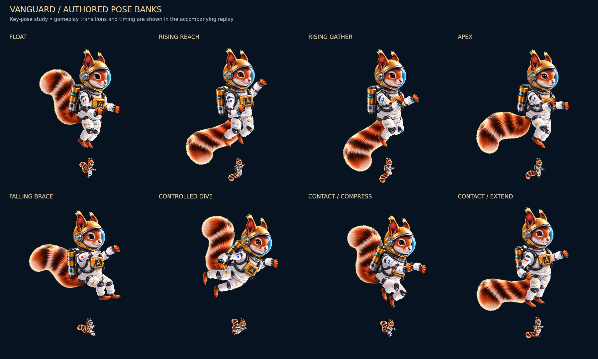

# Vanguard: whole-body flight maneuvers

The prior review still moved the near hand only about 2.45 pixels at gameplay
size. The owner correctly saw a static flight drawing with a changing tilt.
Flight and Upright now use a separated-part character: independent upper
arms, forearms/hands, thighs, shins/feet, a stable head and torso, and a tail
that follows vertical movement. This permits visibly different whole-body poses.

[Gameplay comparison](Vanguard-Maneuver-Gameplay.mp4) ·
[Planet contact and push-off](Vanguard-Maneuver-Contact.mp4) ·
[Limbs with body and tail held fixed](Vanguard-Maneuver-Limbs.mp4)



## Try the styles

Select Vanguard in beta, then open **Hangar → Suits → Vanguard Motion** or the
same picker while paused. The saved selection persists.

| Option | Current motion |
| --- | --- |
| Flight | New anatomy with an asymmetric forward reach, trailing leg, tucked climb and open falling brace. Production default. |
| Upright | New vertical torso with bent elbows and knees; reaching ascent, knees-forward fall, and contact compression/extension. |
| Cinematic | Original artwork and motion, retained for comparison. |
| Continuous | Original faster tail/heading response, retained for comparison. |

The existing production ownership requirement remains 500 earned stars;
Vanguard stays open in beta. The separate Depot animation is unchanged.

## Animation direction

The owner's jump/fall/landing reference and squirrel poses informed the change
in silhouette. NASA's [neutral-body-posture research](https://ntrs.nasa.gov/citations/20150020939)
informed the bent-limb float, and its [MMU spacewalk reference](https://www.nasa.gov/image-article/astronaut-bruce-mccandless-performs-the-first-untethered-spacewalk/)
informed the controlled backpack posture. Delayed recoveries use
[overlap and follow-through](https://www.animationmentor.com/blog/tutorial-animate-overlap-and-follow-through/).
The large direction-dependent tail sweep is stylized for this game's gravity;
it does not model aerodynamic drag in a real vacuum.

Normal flight reaches its apex about 346ms after a tap. Seven authored banks
work on independent clocks, blended through damped joints:

| Bank | Body action |
| --- | --- |
| Float | Bent elbows and knees, slow alternating balance adjustments. |
| Rise | One arm reaches while the other gathers; legs trade tuck and extension. |
| Apex | Limbs open and rebalance as vertical speed changes sign. |
| Fall | Hands rise and knees come forward into a suspended brace. |
| Dive | Controlled forward lean, a guiding arm and trailing limbs. |
| Thrust | Short additive shoulder load, hand recovery and leg kick. |
| Land | Compression, extension and airborne recovery after actual contact. |

A tap adds jet pressure immediately. A 340ms arm gesture can finish through
multiple 100ms taps; sustained ascent never restarts its locomotion bank.
Separate entry/exit velocity thresholds prevent pose chatter near the apex.
Contact retains its own clock through an immediate tap. An overhead impact
braces the arms without pretending the feet landed.

The tail root responds before the heavy tip. It hangs down/back in ascent and
sweeps up/back during descent. Smoothly limited curvature prevents the fur
patch from pinching during a rapid reversal. Twin attached nozzles use a
white/cyan core and warm falloff driven by accepted acceleration, without
random flicker. Animation values never feed forces, collision circles, scores,
input acceptance, camera movement or random seeds.

## Artwork and rendering

`art-src/vanguard/maneuver/parts-keyed.png` is the generation master. The
deterministic exporter removes the green matte, isolates twelve complete
components and registers their measured attachment points into a 1024×768 RGBA
atlas. Components have empty gutters; neighboring tail tips cannot bleed into
another cell. The source, registration and generation brief are checked in.

`vanguard-maneuver.ts` samples poses in joint space. Bone lengths and the head
and torso scales remain constant. The painter draws ten body pieces and a
32-triangle tail. It does not crossfade duplicate characters or deform the face.
The new atlas loads with Vanguard only. Missing or malformed artwork retains
the previous rig and can retry later. Original styles always use the original
registered art. No runtime dependency was added.

## Review and validation

The gameplay clip uses the actual simulation and production canvas painter at
390×760, with an ordinary fixed camera, 100/180/300ms tap groups, real gravity
arcs, scoring, a down swipe and contact. No pilot position resets are used.
All three styles receive identical inputs and are compared on every simulation
tick. The separate contact clip labels its tall chamber and following camera.

The limb diagnostic replays those same recorded states while holding body
rotation, head rotation, heave, tail and exhaust fixed in display copies. The
pose sheet shows authored targets; gameplay springs into them rather than
snapping between stills. These are native-canvas renders, not browser or device
recordings.

With body tilt removed, sustained rapid taps produce approximately 10.5–11.3px
near-hand travel, 9.1–9.5px far-hand travel, and 6.6–9.2px foot travel at size 52.
Those are joint-space landmarks, not the earlier raster-component measurement,
so the diagnostic video is the visual comparison. The maximum sampled limb
step is under 2px at 60 Hz. Checks also cover 30/60/120Hz timing, opaque joint
coverage, constant head scale, nonfolding tail geometry, retained contact,
lazy loading/retry, original styles and fallback art.

Native isolated painter measurements and input provenance are preserved in
[maneuver-review-summary.json](maneuver-review-summary.json); controller/raster
measurements are in [maneuver-checks.json](maneuver-checks.json). Phone/Safari
frame pacing and final artistic acceptance still need in-game review.

Production/beta menu and engine checks, original inertia/fallback rendering,
the Depot sequence, Spill/welcome simulation and all 30 shipping-art QA groups
pass. The unrelated broad Spill UI harness already has a mocked
`getTransform()` failure documented in the [previous review](FLIGHT-RIG-REVIEW.md).

## Reproduce

```sh
node illustrated-src/export-vanguard-maneuver.mjs
node illustrated-src/export-sandbox.mjs
node illustrated-src/test-vanguard-maneuver.mjs
node illustrated-src/test-vanguard.mjs
node illustrated-src/test-vanguard-inertia.mjs
node illustrated-src/review-vanguard-flight.mjs
node illustrated-src/review-vanguard-maneuver.mjs
node illustrated-src/test-vanguard-depot.mjs
node illustrated-src/test-spill-welcome.mjs
node illustrated-src/test-spill.mjs
python illustrated-src/verify-art.py
```

The build accepts `ACORNAUT_TSC` pointing to `tsc.js`. Canvas scripts accept
`ACORNAUT_CANVAS`; DOM checks accept `ACORNAUT_HAPPY_DOM`.
Set the same `ACORNAUT_QA_OUTPUT` for both review scripts. Encode their frame
directories at 30 fps; simulation runs at 60 Hz. Build 192 is exported normally;
generated `docs/js*` files must not be edited by hand.
