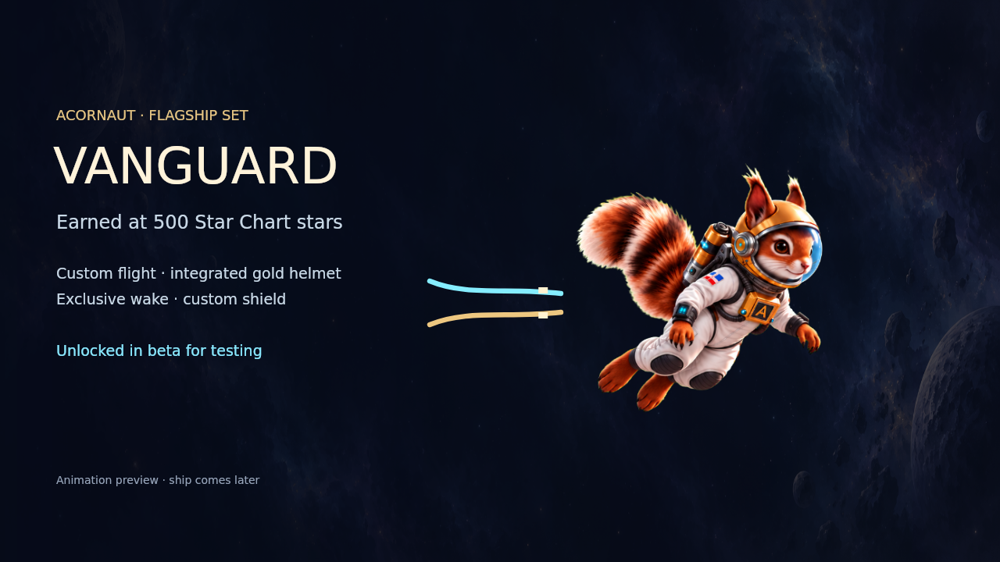

# Vanguard flagship character

Vanguard matches the squirrel from the existing menu/loading paintings:
russet striped fur, ivory technical fabric, graphite joints, gold hardware,
clear integrated visor and small cyan electronics. This is the character
release; a custom Hyper Run/Spill ship remains a later task.

[Animation preview](vanguard-preview.mp4) · [32-pose contact sheet](contact.png)

## Try it

On this branch's beta build: Hangar → Suits → **FLAGSHIP · 500 STARS** →
**Vanguard**. It opens at zero stars in beta, including a fresh save.
Production retains the real 500-star requirement. Production currently has
100 missions/300 earnable stars, so a new production player cannot earn it
until that route expands. This PR does not activate production's 260 route.

## Delivered

- 32 distinct whole-character drawings: 16 tap, 8 dive, 8 contact/rebound.
  Frames ship at 512×512 RGBA, four times the existing standard sprite pixels.
- One registered torso pivot and measured 60px integrated helmet radius.
  Poses move anatomically; the painter does not stretch the tail/body or
  stack the generic scale pulse over them. No other suit's frames change.
- A dedicated selector makes tap, dive and contact reachable. Existing
  tap-rewind timing, flight physics and collision behavior remain intact.
- Fixed gold/cyan wake, suit-exclusive. Other trails cannot be selected while
  Vanguard is worn. Switching suits restores the previous trail selection.
- A cyan lens and rotating gold shield arcs, only while a real shield charge
  exists. No added protection, powerup, modifier or active ability.
- Additive 500-star suit and wake rewards. Existing rewards, paid ledgers,
  mission contracts and the proposed Rig Runner title remain intact. The
  fixed wake follows permanent suit ownership after save reconciliation.

## Assets and performance

`art-src/vanguard` retains the original 1254px master, transparent master,
eight four-pose source sheets, prompts and measured registration. The dense
initial sheet was rejected for crowded framing and is not shipped.
`export-vanguard.mjs` performs chroma extraction and registration, not creative
redrawing or interpolation. Runtime animation is approximately 5.4 MiB on
disk and 32 MiB decoded. It loads on equip and is excluded from the background
prefetch sweep. The first-pose still appears until the full bank is ready;
partial failures cannot shift the sequence and a later equip can retry.

The marketing clip uses `paintFlightPreview`, the same painter the game uses.
It is labeled an animation preview, not a recording of gameplay. Actual
world-painter captures are [flight](actual-flight.png) and
[contact](actual-bounce.png). Final fluidity and phone performance still need
owner playtesting; these renders are not an iPhone browser performance test.

## Validation

- TypeScript production/beta export.
- `test-vanguard.mjs`: fresh-beta equip, production 499/500 eligibility,
  retained ownership/wake, disabled incompatible trail buttons and engine
  transactions, actual simulation tap/dive/contact, replay star retention.
- `test-vanguard-render.mjs`: actual world painter selects the custom frames;
  all 32 are reachable, fixed canvas registration and partial-bank fallback.
- Existing Star Map simulation/UI suites: production progression, all 260 beta
  completion seams, three unchanged barriers, migration/seed/replay contracts.
- Full art audit: Vanguard and all other checks pass except the unchanged
  main-branch Switchback size mismatch (1254px asset vs 256px validator).
  Baseline confirmed with main's validator and matching asset Git SHA
  `2ae1f4d15a3b9837a01e24f5d38054970a5f2b56`. No gate was weakened to hide it.

## Decisions still open

- Tutorial use: no substitution or gift change. Existing Ion tutorial kit stays.
- Ship: later, following this ivory/gold/graphite material language.
- Optional suit-only pal concept: a small acorn-shaped maintenance drone with
  matching gold shell and cyan lens. Appearance only; no new gameplay effect.
  Not added to the roster in this PR.

## Rebuild

Run `node illustrated-src/export-vanguard.mjs`, then the normal
`node illustrated-src/export-sandbox.mjs`. `ACORNAUT_CANVAS` may point to
`@napi-rs/canvas`; `ACORNAUT_TSC` may point to TypeScript's `tsc.js`.
Render review media with `node illustrated-src/test-vanguard-render.mjs`.
The UI tests accept `ACORNAUT_HAPPY_DOM` for the installed happy-dom entry.
