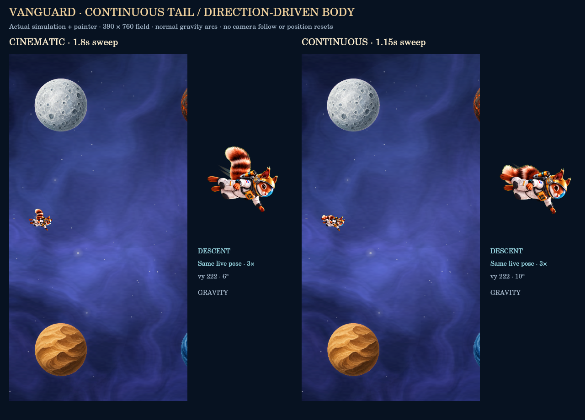

# Vanguard flight revision

The owner's phone recording showed that Cinematic held one pose during rapid
taps, while Continuous mostly moved the legs. Ordinary descent waited behind
a 1.76-second tap clip, so the body could remain nose-up while falling.
Those were gaps in the earlier controller and in its test coverage.

[Normal phone-field comparison](phone-preview.mp4) · [Input/heading trace](phone-trace.json)



## Current motion

- A continuous **whole-character tail loop** replaces the jump/tuck bank.
  Sixteen new drawings sweep the thick striped tail while arms, knees and
  helmet remain steady. The tail keeps moving during climb, level flight,
  descent, repeated taps and no-input glides. It also idles on the ready
  screen; pause still freezes it.
- The body follows vertical flight direction with eased heading: climb,
  level at the apex, then shallow descent. It no longer waits for a tap clip
  or a tail cycle to finish. There is no leg pump, squash or jump on input.
- A tap produces a restrained thruster pulse. The body's small reaction
  comes from easing toward the changed velocity, without a pose restart.
  A swipe permits a deeper heading; gravity alone stays shallow. The entire
  registered drawing tilts, preserving shape and continuing the tail motion.
- Cinematic uses a 1.8-second tail sweep with a 130ms body response;
  Continuous uses a quicker 1.15-second sweep with a 90ms response. Both
  remain available in beta's Hangar and Pause. Switching changes only
  presentation and preserves the current phase.
- The existing surface dust survives a bounce followed immediately by a
  tap. Shield, fixed wake, hitboxes, forces, scores and other suits are intact.

Vanguard stays unlocked on fresh beta saves. Production retains the 500-star
requirement and existing ownership. This revision adds no ship, pet or mode.

## Assets and reproducibility

The built-in imagegen tool produced `art-src/vanguard/tail-loop.png` from the
original flagship frame, then corrected the backing and cell margins.
`tail-prompts.json` preserves both exact prompts. The original master and
32-pose source sheets remain archived in `art-src/vanguard`.

`export-vanguard.mjs` extracts whole drawings and keys the green backing.
`tail-heads.json` records scale/position measured by fitting the unchanged
helmet/face to the first cell, rather than to moving tail bounds. The export
fixes every helmet at (350,200), radius 60, on a 512px RGBA canvas. The drawn
sweep determines frame order. The sequence follows a single down/up sweep, ordered by the painted tail mass.
No tail pieces are cut out, stretched or rigged.

The active bank is 16 frames (16 MiB decoded, down from 32 MiB). It loads on
equip only. A partial load keeps the exact first-frame still and can retry;
the fallback follows the same body heading while its tail remains still.
Superseded runtime poses are removed; source masters remain available.

```bash
node illustrated-src/export-vanguard.mjs
node illustrated-src/export-sandbox.mjs
node illustrated-src/test-vanguard.mjs
node illustrated-src/test-vanguard-render.mjs
node illustrated-src/test-vanguard-flight.mjs
```

The exporter and canvas tests use `ACORNAUT_CANVAS` when native canvas is not
on the default module path. The UI test accepts `ACORNAUT_HAPPY_DOM`; the
TypeScript exporter accepts `ACORNAUT_TSC`.

## Evidence and limits

`test-vanguard-flight.mjs` now flies a normal 390×760 field for ten seconds,
with actual simulation controls, gravity arcs, a rapid-tap burst, a swipe,
and gate scoring. There is no follow camera, artificial y reset or long
falling chamber in this primary preview. Both visual modes assert identical
physics each tick. Their tails visit all 16 poses and headings visibly cross
between climb and descent during ordinary short arcs.

The extended [contact/swipe chamber](vanguard-preview.mp4) remains supplemental
coverage for a surface contact followed by a tap on the next tick. Its camera
follows the pilot and leaves extra vertical room; it is labeled accordingly.
The menu/engine tests also cover fresh-beta and production ownership, mode
persistence, pause, ready idle, independent visual time, repeated taps,
no-input tail movement and descent interrupted midway through a tail beat.

Native-canvas renders verify the actual painter, not mobile Safari layout or
real-device frame pacing. The owner's phone playtest remains the appearance
and feel review. This change is submitted as a PR, without merge or deploy.

Current-main art audit: Vanguard passes. The full audit retains the existing
Switchback 1254px still mismatch; its separate fix is in open PR #188. No
validator gate was relaxed for that failure.
