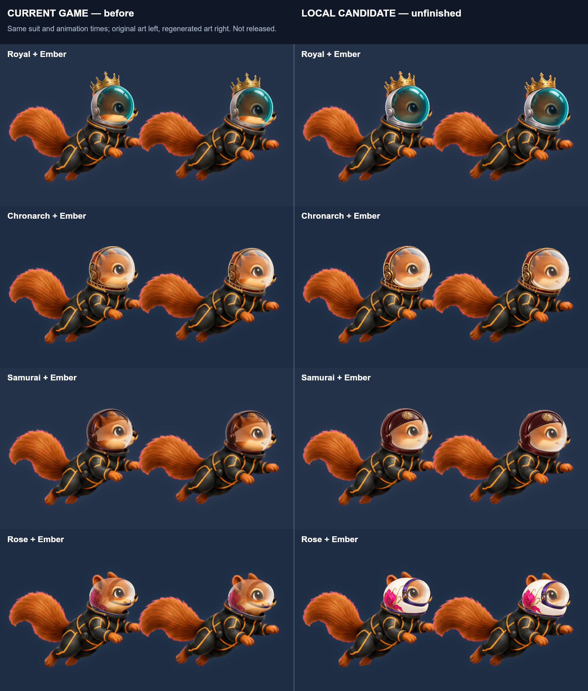
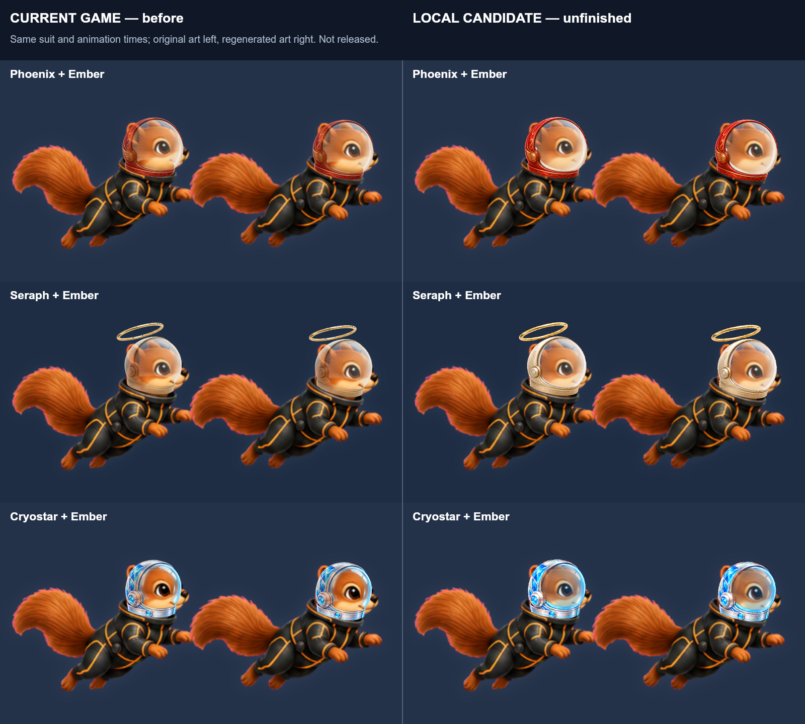
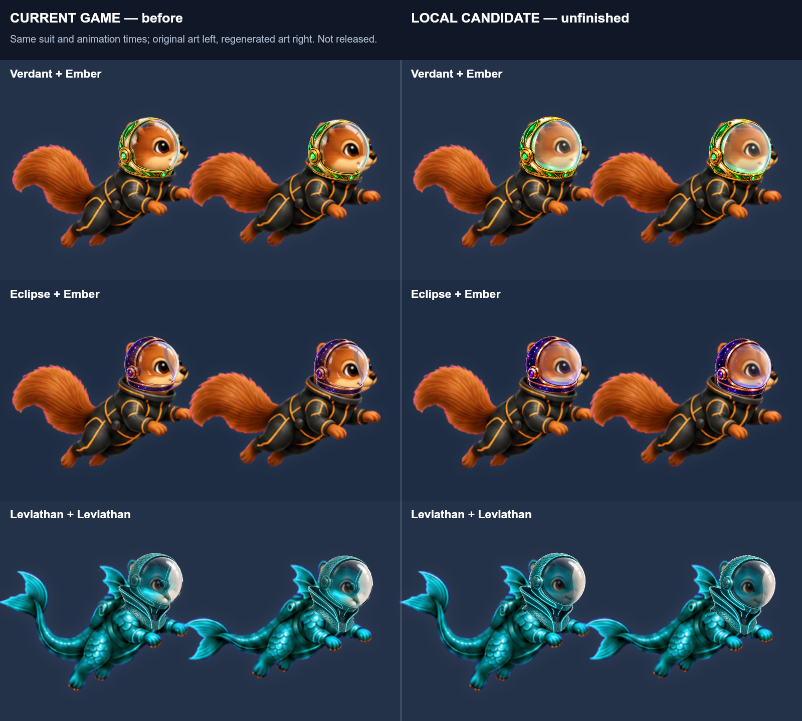
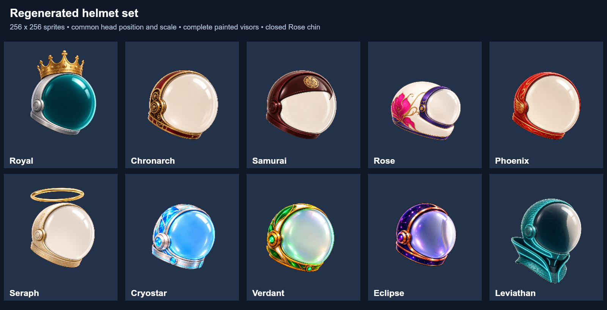

# Regenerated continuous-glass helmets

Issue #262: lower face panes were erased by runtime rear-collar cutouts. The
replacement artwork contains a continuous visor with no rear rim crossing the
muzzle, and the old cutout operations are removed. Rose also has a closed chin
guard; the previous open underside was defective.

## Scope and rendering

Ten whole helmets are regenerated: Royal, Chronarch, Samurai (`sammie`), Rose
(`princess`), Phoenix, Seraph, Cryostar, Verdant, Eclipse and Leviathan.
The original images guide their palette, silhouette and illustration style.
The art has small design differences and remains subject to visual review.

Each replacement exports to a 256x256 transparent sprite with the same head
registration `[128,136,80]`. Uniform scaling and translation leave room for
crowns, the halo and neck guards. Ornament bounds do not set head size. The
original source registration and design tilt are retained by the export and
renderer, so this normalization does not refit suit sockets or animation.

Only the glass becomes translucent when worn. Pane boundaries keep painted
shells, jewels, filigree, flowers and chin guards opaque and correctly colored.
The game and Flight Studio use the same boundaries. No suit artwork, DOME
socket, animation bank, motion timing, save key or gameplay rule is changed.
The other twenty helmet images, including the nine repairs in #216, are intact.
Art stamp 267 refreshes cached sprites and modules.

## Source and reproducible export

[`art-src/visor-glass`](../../../art-src/visor-glass) contains each original
reference, generated master, prompt set and SHA-256 export receipt. The source
export runs `illustrated-src/export-visor-glass.mjs` before building the game.
It removes only the exterior green backing and preserves painted glass inside
the helmet. The detached halo opening is explicitly identified as exterior.
No face-window cutout, sampled replacement strip or reference-alpha mask is
applied to the regenerated art.

The first generated four images contained painted checkerboards rather than
alpha. Their backgrounds were regenerated on a uniform extraction plate; the
checked-in masters are those final plates. Generated master provenance remains
intact. A C2PA thumbnail is omitted only from the Canvas decoder input to avoid
an SVG mis-detection in that library; original master bytes are retained.

## Validation and review

Current main `daad832642b7af5cda4358fb60f4ce40026c638d` is integrated. The conflict resolution
preserves all helmet images, source masters, registrations and painters from
`92aeedad68d71a82e472713ec94af634d2bb8968` byte-for-byte. Generated outputs
were rebuilt at stamp 267, above main 265 and the separate Shop draft 266.
Runtime checks bind to `6407485a11929ec7ec4559effefaa09e4b5ea9e3`; the final
receipt changes only review files.
The original Royal defect was also reproduced on acornaut.app build 1.0.12.262.

- The artwork regression checks exact ten-helmet scope, source/export hashes,
  shared registration, continuous lower panes, closed Rose chin, halo opening
  and sufficient outer margins for all decorations.
- The compositor regression compares all thirty game and Flight Studio
  sprites pixel-for-pixel, checks ten translucent lower panes, preserves
  independently selected decoration colors/alpha and verifies cache reuse.
- The standard helmet-animation regression guards body/frame/timing behavior.
- Docker runs the source, lab and Studio builds, typecheck, all 32 art groups,
  the complete 57-test harness and platform bridge gate. Typecheck, all 32 art
  groups and bridge passed; the harness passed 56/57 with one pre-existing
  High Orbit pixel-equality failure. See [validation receipt](validation.json).
- Fresh headless Edge contexts at 390px verify Loadout for Royal, Chronarch,
  Rose, Cryostar, Verdant and Eclipse with disposable test ownership. These
  are browser checks, not an iPhone or App Store validation.

The paired images show identical suit poses: **current game left; regenerated
candidate right**. Leviathan is shown with its compatible suit. These compare
the baseline source artwork/renderer against the regenerated candidate.

Browser captures: [Royal](royal-after.png), [Chronarch](chronarch-after.png),
[Rose](rose-after.png), [Cryostar](cryostar-after.png),
[Verdant](verdant-after.png), [Eclipse](eclipse-after.png).

The unchanged main commit produces the identical Docker failure: Cinderforge
fallback differs in 22 of 262144 bytes (maximum channel delta 28, first byte
64900). The original candidate passed the same test with Windows Canvas 0.1.100;
that supplementary historical run was not repeated after this integration. Docker uses Linux
Canvas 0.1.100. No High Orbit source, reference image or assertion was changed.
See [unchanged-main baseline result](baseline-high-orbit.txt) and the
[fresh browser receipt](browser-after-conflicts.json). This draft is not an
all-green release approval.

Normalization preserves existing suit registrations. It does not resolve all
existing fit issues: the Ember comparisons still show ears outside Rose's
shell. Per-suit/frame fitting and on-device approval remain visual review items.

