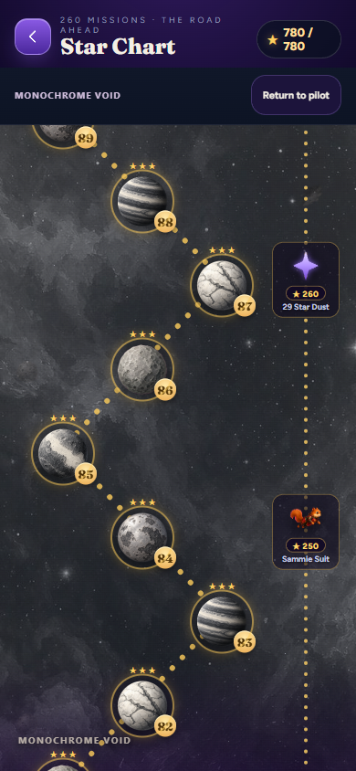
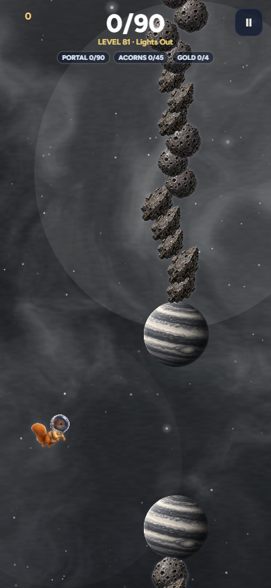

# Twenty-six distinct places to fly

The approved zone proposal is implemented at art stamp **252**. Open the
[visual gallery](index.html) to inspect all 26 production families, or use the
[exact roster](ROSTER.md) for filenames and ownership.

## What players see

- Every zone owns **five different planets**, with no exact planet reused
  in another zone: 130 assigned planets, comprising 29 originals and 101 new
  paintings. Four old library alternatives remain unassigned.
- Every zone owns **two or three debris sprites**: 55 in total, comprising
  all 27 originals and 28 new paintings. Debris IDs are also exclusive.
- Flight draws from a shuffled five-planet bag. All five appear before a bag
  refills, and the refill cannot immediately repeat the last planet. Both
  sides of a gate retain the same world so its opening reads clearly.
- Star Chart nodes use that same catalog family. Every ten-mission zone
  shows all five planets twice. Chart debris uses the same local material
  pool; visible zone images load on demand and redraw when ready.
- Star Chart Spill missions also use their zone's debris. Standalone endless
  Spill and tunnel mode keep their original 27-sprite vocabulary; Arcade
  keeps its established rendering style.

## Monochrome readability

The grey palette stays grey. Planets receive a faint soft rim only when their
measured color is close to the local painted background. The effect fades out
as natural contrast increases. Bright backdrops use a soft dark separation;
dark backdrops use the existing pale, low-opacity glow. It does not change the
planet texture, collision radius, opening size or background painting.

Flight samples a 32×24 copy of the already-painted sky, before foreground
objects, at most twice per second. A five-point neighbourhood limits reactions
to individual stars. The color-distance threshold is 0.38 with a smooth fade;
unavailable canvas reads fall back to existing sky metadata. Star Chart uses
the same contrast rule against its zone metadata. Debris retains its previous
safety rim. Cached halo canvases are bounded to 48 entries.

| Monochrome Star Chart | Monochrome flight |
|---|---|
|  |  |

Chart images capture the actual browser UI. Flight images use the actual game
renderer with a held, normally sized gate positioned for visual inspection;
they are controlled scenes, not evidence of completing those missions.

## Preservation and verification

The [integrity receipt](integrity-verification.json) compares against main
`85f30e60b8b7568cdd911a9cf888122b47833d83`: **1,470 original art files**,
the procedural sky generator, both campaign manifests, campaign/rewards,
progression and save source are byte-identical. Existing background layer
recipes, washes, pan speeds and transitions were not edited.

The only regenerated original output is Arcflash's derived 256px fallback
portrait, rebuilt from its unchanged live rig to resolve the existing exact
pixel check before the owner-authorized merge. No planet, debris, background,
Arcflash source painting or live-rig pixels changed in that repair.

The new family test compares **780 geometry fixtures**: all 260 missions at
390×844, 844×390 and 1440×900, against frozen main
`4d55b82ae3f99adb2481f506530a51ada646d214`. It checks initial gates, blockers,
pickup geometry and drift/tilt phases, plus ten simulated seconds in each of
78 active Spill fixtures. Cosmetic fields are excluded from the hashes and
separately required to belong to the correct family. The later main merge
adds only the separate Flight Studio tool to that gameplay baseline.

Verification completed on Windows using the repository-authorized local
fallback because Docker Desktop's engine was unavailable. Dependencies are
workspace-local; no host system packages were installed.

- Strict source export and lab build; source/lab TypeScript check.
- All **32 shipping art QA groups**, including raster decoding, dimensions,
  alpha edges and existing character checks. Existing suit-bank review flags
  and a Pillow deprecation warning remain unrelated to these zone additions.
- Family ownership, shuffle seams, all five map worlds, contrast rules,
  missing-image ID stability, request deduplication and all 129 output hashes.
- [Browser verification](browser-verification.json): all 26 chart families
  match their rosters and paint nonempty canvases; all 26 controlled flight
  scenes load their local art; Monochrome also checked in landscape and desktop.
  No page errors or failed planet/debris requests. Cold boot requests only the
  five Deep Space planets. Timing values are desktop diagnostics, not a claim
  about physical-phone performance.
- Platform bridge and whitespace checks; no repository lint script exists.

The final full harness passed **all 51 tests with zero failures or skips**,
recorded in [validation.json](validation.json). The gallery also
passed navigation, all 213 image decodes and page-width checks at 1440 and 390px.

The first complete run found an inherited `test-arcflash-render.mjs` failure:
main's fallback portrait differed from its current live renderer by 25 pixels /
28 channel bytes, maximum channel difference 3. On 9 September the owner
approved fixing the check and merging. The fallback is now exported from the
shipping rig during the normal build by `export-arcflash-portrait.mjs`. The
integrity receipt verifies identical live-rig hashes on both revisions and
**zero differing fallback pixels** after regeneration. The strict assertion
and all animation/attachment checks remain intact; no test waiver is used.

## Source and reproduction

`catalog.ts` owns the roster, `planet-family.ts` the cosmetic shuffle,
`planet-contrast.ts` conditional separation, and `art.ts` stable sparse image
banks. Simulation uses a separate cosmetic random stream. Spill remaps the
original art roll after its original rejection loop, preserving gameplay RNG
consumption. New assets do not force the entire library onto the boot load.

Transparent masters, exact prompts and refinements are in
[`art-src/zone-identity`](../../../art-src/zone-identity/README.md). The
[shipping manifest](../../../art-src/zone-identity/shipping-manifest.json)
binds each master and numeric output to a SHA-256 hash. Rebuild with:

```sh
node illustrated-src/export-sandbox.mjs
node illustrated-src/build-lab.mjs
node illustrated-src/build-flight-studio.mjs
node illustrated-src/run-tests.mjs
python illustrated-src/verify-art.py
node illustrated-src/review-zone-integrity.mjs
node illustrated-src/review-zone-identity.mjs
```

Serve `docs/` locally, then run `review-zone-browser.mjs` with an available
Playwright/browser and `ACORNAUT_QA_URL` set to that server. Review scripts
write only local evidence. Browser fixtures use an isolated profile and do
not access an installed player's save. The original illustrated proposal
remains [here](../zone-identity-proposal/REVIEW.md) as a historical record.
