# Acornaut: 26 distinct destinations

**Proposal only · 9 September 2026 · audited source `4b15f97fbdfc0e53f60f2536dfe9f64c3a3fe4dd`**

This is an illustrated proposal for all 26 Star Chart zones, not an implemented asset pack. The recommendation is five distinct planets per zone, two or three debris types, no exact cross-zone planet reuse, and a zone-only visual selector. All existing background files, procedural recipes, washes, pan settings, geometry, progression, rewards and saves remain unchanged.

The desired result is diversity inside each destination and recognition between destinations. A zone should have related materials, not five recolors of one globe. Use five surface roles where appropriate: a signature world, a geological world, an atmospheric world, a contrasting-value world and a strange local landmark. The material mix can vary with the zone; forcing every zone to contain a gas giant or a ring would create a new kind of repetition.

## Findings

The live source has 33 planet sprites and 27 debris sprites. Those planets occupy 119 preferred-pool memberships across 26 zones. Only P32 has a single preferred-zone assignment, and that assignment is the lava world in Bone Desert. P15 appears in seven preferred pools (26.9% of zones); P21 and P30 each appear in six (23.1%). These are membership counts, not measured screen-time percentages. The claim that a planet appears in 40% of zones was not tested as a play-session statistic.

More importantly, `sim.ts` chooses from the preferred pool on a 55% branch and from the global contrast-eligible library on a 45% branch, with up to ten rejection attempts and a local fallback. The global branch can select a local planet too; 45% is not the exact off-zone rate. Reassigning catalog pools alone cannot provide exclusivity. Selection uses independent `Math.random()` calls, so there is no anti-repeat bag. A gate intentionally paints the same planet above and below; preserve that pairing and diversify across gates.

Regular flight debris uses the zone pool, but the separate Spill/Debris Field selector draws globally, excluding four dark sprites. Zone-scoped Spill debris would require a separate implementation. Arcade also has its own rendering vocabulary; do not promise that 130 painted planets will appear there unchanged.

The most noticeable consecutive overlaps are in the green-sky run: Emerald Expanse and Alien Jungle share P21/P22/P30; Alien Jungle and Acid Swamp share P13/P30; Acid Swamp and Aurora Crown share P30. Gold-sky zones 12–14 need dry fossil, warm amber and scorched solar materials respectively. Green-sky zones 16–19 need ordered geology, dense life, chemistry and polar light respectively.

## Recommended standard

1. Treat each zone roster as exclusive in Star Chart. Resolve both the map and flight through the same stable asset identities. Match zones by name/id, not the position in ENVS: chart order and environment indices differ.
2. Use a shuffled five-item planet bag. Show each planet once before refilling, and prevent the last item of one bag from repeating as the first of the next. Keep a gate’s top and bottom planet identical. A 100- or 200-gate run then retains all five identities throughout the run.
3. Use a separate visual RNG so changing a skin does not consume the mission RNG or alter gate geometry, rewards or objectives. Seed it reproducibly for review and record its visual version independently from gameplay contracts.
4. Debris gets two or three material families, with variation in rotation and the existing safe size range. Do not add new debris types as a disguised difficulty increase. For a future Spill adaptation, filter within the zone and repair unreadable local art; never silently escape to a global family.
5. Preserve backgrounds exactly, including sky-gen.ts, zone paintings, washes, remaster opacity, pan and fallback/dark plates. Fix foreground contrast with solid cores, painted edge light, value separation and surface pattern. Global mean-color separation alone does not prove readability over a bright local patch.
6. Give new planets opaque circular contact-bearing cores. Small crystals, reefs and rings must not imply a different hit shape. Keep debris visibly compact and angular. No open vortex or see-through ghost planet should masquerade as a solid bounceable world.
7. Keep map labels, mission IDs, 780 objective slots, rewards, PAL assignments and the current gate/pace/opening/sway curves intact. Art progression is a proposal about discovery and visual rhythm, not a rebalance.
8. Preserve legacy numeric indices and published files during migration. Current art loading compacts successful sprites into arrays, so a missing file can shift later entries. A future named/stable slot map should preserve identity on failure and substitute only a reviewed local fallback.
9. Budget loading by current zone plus the next zone, with bounded caches. Do not eagerly decode 130 planets just because the current loader eagerly requests 33. Keep high-resolution masters separate from final measured 256px cutouts unless a separately reviewed resolution change is justified.
10. The generated boards are direction studies. They reinterpret existing entries and contain a few approximate materials; the numbered original thumbnails and proposal.json are authoritative for retained assets. Every new sprite still needs its own master, transparent export, fitting, game-size contrast review and collision/readability checks.

## Art budget

| Asset | Existing art reused | New production art | Final exclusive slots |
|---|---:|---:|---:|
| Planets | 29 | 101 | 130 |
| Debris | 27 | 28 | 55 |

Remove P07, P14, P17 and P32 from the proposed Star Chart pools only. Preserve their files and indices for alternate uses. P07/P17 are vortex-like silhouettes; P14/P32 repeat the lava language retained in P03. This is not an instruction to delete files.

## Progression review

There are 260 authored levels in 26 groups of ten, used by both the current production and beta chart. Each group has five main Free Flight missions, a Lost in Space mission, a Deep Space mission, a Debris Field mission, an Arcade mission and a sixth Free Flight mission with fog. Level 1 is a special 8-gate, no-fail introduction. The numbers below come from the manifest; they are not measured completion durations.

Main Free Flight caps generally build through the first 100 levels, then remain at 100 gates for zones 11–20 and 200 gates for zones 21–26. Fog missions keep their separate shorter lengths. Zone 11 uses pace/opening/sway 1.00/1.10/1.00, zone 20 reaches 1.20/0.90/1.20, and zone 26 reaches 1.26/0.84/1.32. Acorn targets reset against the longer tier at level 201 and ramp again. No tuning changes are proposed here.

Within each zone, introduce all five local planets early and keep the bag diverse. Missions 1–2 establish the identity; 3–5 sustain it during tap, bounce and no-shield goals; 6–9 test whether it survives the alternate mode presentation; 10 should show familiar readable silhouettes through fog. Longer later runs increase the need for repeat control, not for larger, noisier pools.

| Zone / levels | Main Free Flight gates | Fog gates | Pace | Opening | Sway |
|---|---|---|---|---|---|
| 01 Deep Space / 1–10 | 8 / 10 | 10 | 0.91 / 0.92 / 0.96 / 1.06 | 1.12 / 1.18 | 0.8 / 1 |
| 02 Nebula Nursery / 11–20 | 20 | 10 | 0.91 / 0.96 / 1.06 | 1.18 | 0.93 |
| 03 Ice Moon / 21–30 | 30 | 15 | 0.91 / 0.96 / 1.06 | 1.18 | 1.06 |
| 04 Solar Furnace / 31–40 | 40 | 22 / 20 | 0.91 / 0.96 / 1.06 | 1.18 | 1.19 |
| 05 Sapphire Abyss / 41–50 | 50 | 25 | 0.91 / 0.96 / 1.06 | 1.18 | 1.32 |
| 06 Crystal Belt / 51–60 | 30 / 60 | 30 | 0.945 / 0.96 / 1.095 | 1.155 | 0.8 |
| 07 Crimson Storm / 61–70 | 70 | 35 | 0.945 / 0.96 / 1.095 | 1.155 | 0.93 |
| 08 Violet Realm / 71–80 | 24 / 80 | 80 / 40 | 0.945 / 1.095 | 1.155 | 1.06 |
| 09 Monochrome Void / 81–90 | 35 / 90 | 45 | 0.945 / 0.96 / 1.095 | 1.155 | 1.19 |
| 10 Hypervivid / 91–100 | 45 / 100 | 50 | 0.945 / 0.96 / 1.095 | 1.155 | 1.32 |
| 11 Rust Belt / 101–110 | 100 | 55 | 1 | 1.1 | 1 |
| 12 Bone Desert / 111–120 | 100 | 60 | 1.022 | 1.078 | 1.022 |
| 13 Golden Hour / 121–130 | 100 | 65 | 1.044 | 1.056 | 1.044 |
| 14 Solar Corona / 131–140 | 100 | 70 | 1.067 | 1.033 | 1.067 |
| 15 Coral Shallows / 141–150 | 100 | 75 | 1.089 | 1.011 | 1.089 |
| 16 Emerald Expanse / 151–160 | 100 | 80 | 1.111 | 0.989 | 1.111 |
| 17 Alien Jungle / 161–170 | 100 | 85 | 1.133 | 0.967 | 1.133 |
| 18 Acid Swamp / 171–180 | 100 | 90 | 1.156 | 0.944 | 1.156 |
| 19 Aurora Crown / 181–190 | 100 | 95 | 1.178 | 0.922 | 1.178 |
| 20 Pulsar Field / 191–200 | 100 | 100 | 1.2 | 0.9 | 1.2 |
| 21 Time Fracture / 201–210 | 200 | 105 | 1.21 | 0.89 | 1.22 |
| 22 Neon Bazaar / 211–220 | 200 | 110 | 1.22 | 0.88 | 1.24 |
| 23 Prism Storm / 221–230 | 200 | 115 | 1.23 | 0.87 | 1.26 |
| 24 Ghost Nebula / 231–240 | 200 | 120 | 1.24 | 0.86 | 1.28 |
| 25 Blackout Zone / 241–250 | 200 | 125 | 1.25 | 0.85 | 1.3 |
| 26 Event Horizon / 251–260 | 200 | 130 | 1.26 | 0.84 | 1.32 |

## Zone-by-zone direction

The background images are reference studies reconstructed from the unchanged source procedural sky, scrim, current remaster layer and washes at 780×440. They are not live gameplay screenshots; stars/overlays after these layers, transitions, PAL effects, dark-mode variants and objects are omitted. Painted source files remain unchanged. Concept rows appear on a neutral board rather than a replacement background. Descriptive asset names below are proposed study labels, not existing catalog names.

### 01 · Deep Space · levels 1–10

**Direction: Familiar astronomical frontier.** Palette: blue oceans / ochre gas / ivory regolith. Editorial assessment: refine.

The Earth, ringed giant and moon give the opening a strong familiar foundation. The forest ball and turquoise ringed planet dilute that first-home identity.

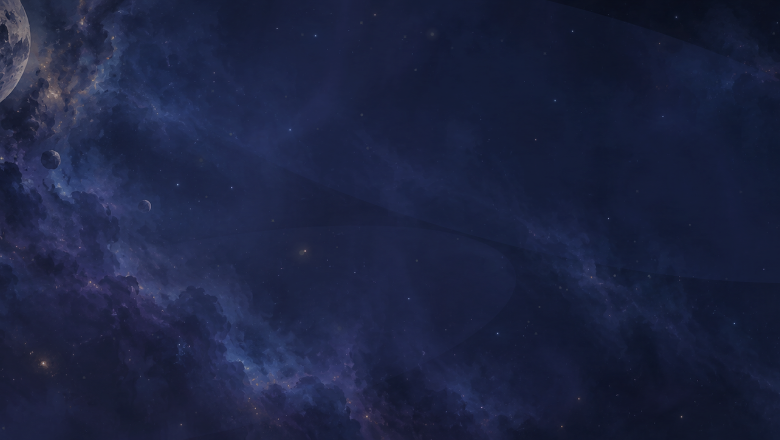

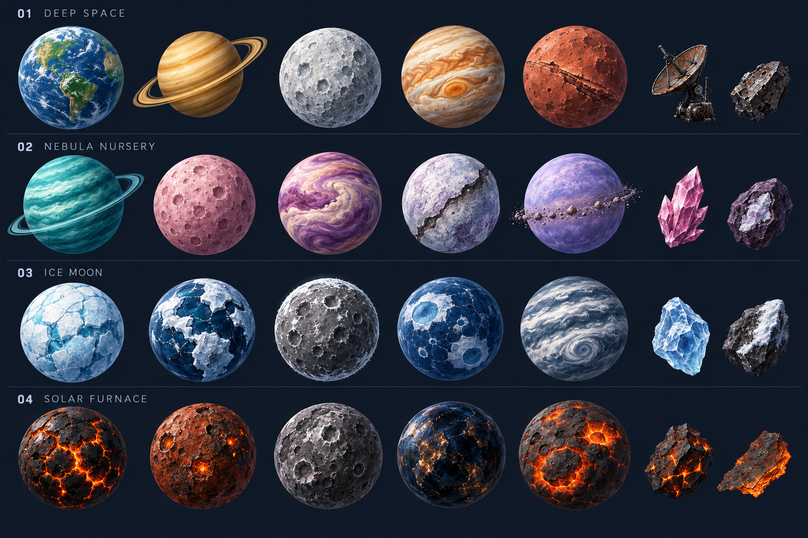

Current preferred planets: P00, P02, P01, P05, P09, P04. Current debris: D01, D21, D24.

| Proposed planet | Action / visual brief |
|---|---|
| Homeworld | Use existing **P00** unchanged. |
| Ochre Rings | Use existing **P01** unchanged. |
| Silver Moon | Use existing **P02** unchanged. |
| Banded Giant | **New.** ochre and cream gas bands with one broad oval storm. |
| Red Frontier | **New.** matte dusty red plains and a single long canyon. |

Debris: Lost Antenna (D01, existing); Nickel Fragment (D21, existing).

Remove from this zone’s preferred lists: planets **P05, P09, P04**; debris **D24**. Rehome rather than delete.

Progression role: Start with recognizable worlds; reveal the canyon and banded giant during the first two missions. Clear silhouettes teach the bounceable-planet vocabulary.

### 02 · Nebula Nursery · levels 11–20

**Direction: Worlds still forming.** Palette: teal / dusty rose / pale lilac. Editorial assessment: rebuild.

The magenta sky has a nursery mood, but the current aurora, city-light and crystal planets read as destinations from unrelated zones.

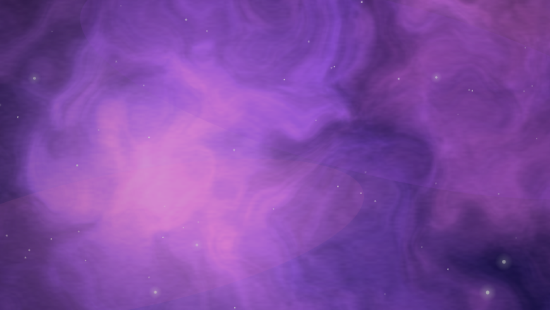

Concept illustration: row 2 of the [zones 1–4 family board](concept-01-04.png).

Current preferred planets: P04, P20, P28, P25, P15. Current debris: D11, D02, D20.

| Proposed planet | Action / visual brief |
|---|---|
| Teal Cradle | Use existing **P04** unchanged. |
| Rose Moon | Use existing **P08** unchanged. |
| Cloudseed | **New.** plum and cream softly folded cloud layers. |
| Pearl Cocoon | **New.** pale compact sphere with a dark curved shell seam. |
| Accretion Pearl | **New.** lavender solid globe with a short dusty equatorial belt. |

Debris: Rose Seed Crystal (D09, existing); Cloudglass Nodule (new: rounded plum stone enclosing cloudy pale inclusions).

Remove from this zone’s preferred lists: planets **P20, P28, P25, P15**; debris **D11, D02, D20**. Rehome rather than delete.

Progression role: Follow the familiar opening with soft, unfinished surfaces. Keep the five worlds visibly different through bands, craters, shell seams and haze.

### 03 · Ice Moon · levels 21–30

**Direction: A frozen expedition.** Palette: cobalt / frost white / slate. Editorial assessment: rebuild.

The preferred pool is dominated by pink, purple, coral and rainbow-crystal imagery. P31 is the existing ice-crust world but is absent here.

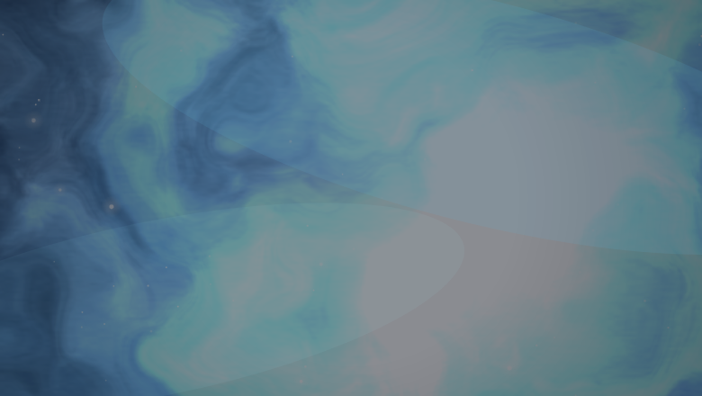

Concept illustration: row 3 of the [zones 1–4 family board](concept-01-04.png).

Current preferred planets: P10, P08, P22, P26, P23, P30. Current debris: D18, D19, D23.

| Proposed planet | Action / visual brief |
|---|---|
| Ice Crust | Use existing **P31** unchanged. |
| Glacier Shelf | **New.** blue-black ocean split by thick white glacier shelves. |
| Frosted Basalt | **New.** charcoal cratered moon dusted with rim frost. |
| Brine World | **New.** deep cobalt sphere with pale circular frozen lakes. |
| Hail Giant | **New.** slate gas world with broad white frozen storm bands. |

Debris: Blue Ice Chunk (D11, existing); Dark Froststone (new: dark angular rock with thick white frost on one face).

Remove from this zone’s preferred lists: planets **P10, P08, P22, P26, P23, P30**; debris **D18, D19, D23**. Rehome rather than delete.

Progression role: Make the first cold zone unmistakable. Dark cores and white ledges should remain readable against the bright ice sky without borrowing pink planets.

### 04 · Solar Furnace · levels 31–40

**Direction: Solid worlds forged by heat.** Palette: charcoal / copper / ember orange. Editorial assessment: rebuild.

The furnace currently favors an electric-blue globe, a chalk shell, ice crust and a grey moon. Heat-themed debris helps, but the planets fight the premise.

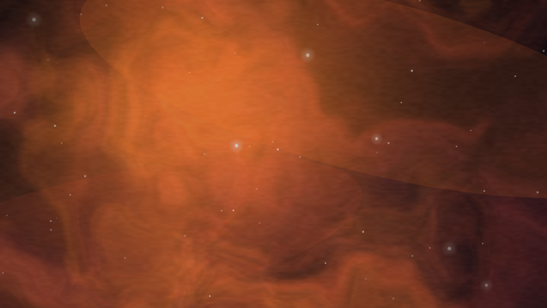

Concept illustration: row 4 of the [zones 1–4 family board](concept-01-04.png).

Current preferred planets: P29, P24, P31, P05. Current debris: D07, D20, D14, D08.

| Proposed planet | Action / visual brief |
|---|---|
| Magma Heart | Use existing **P03** unchanged. |
| Iron Cinder | **New.** oxidized iron globe with sparse hot pits. |
| Ashfall Moon | **New.** matte charcoal cratered sphere with ash-white rims. |
| Quenched Slag | **New.** blue-black glassy globe with dull copper scabs. |
| Vent World | **New.** dark basalt planet with three broad glowing vent basins. |

Debris: Magma Boulder (D12, existing); Ember Plate (D14, existing).

Remove from this zone’s preferred lists: planets **P29, P24, P31, P05**; debris **D07, D20, D08**. Rehome rather than delete.

Progression role: Use heat trapped in heavy material. Reserve atmospheric red cyclones for Crimson Storm and pale solar surfaces for Solar Corona.

**Refine before production:** Separate Vent World from Magma Heart with three broad vent basins rather than another lava-crack network.

### 05 · Sapphire Abyss · levels 41–50

**Direction: Deep ocean without a shoreline.** Palette: midnight blue / indigo / silver foam. Editorial assessment: rebuild.

Brain-like pink lobes, a candy swirl, coral and a rose moon provide contrast but scarcely describe an abyss.

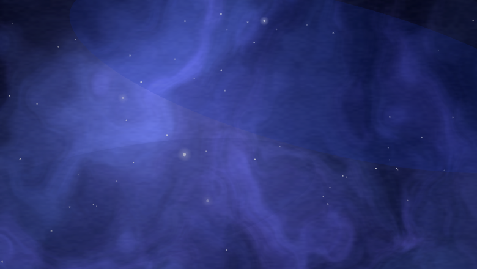

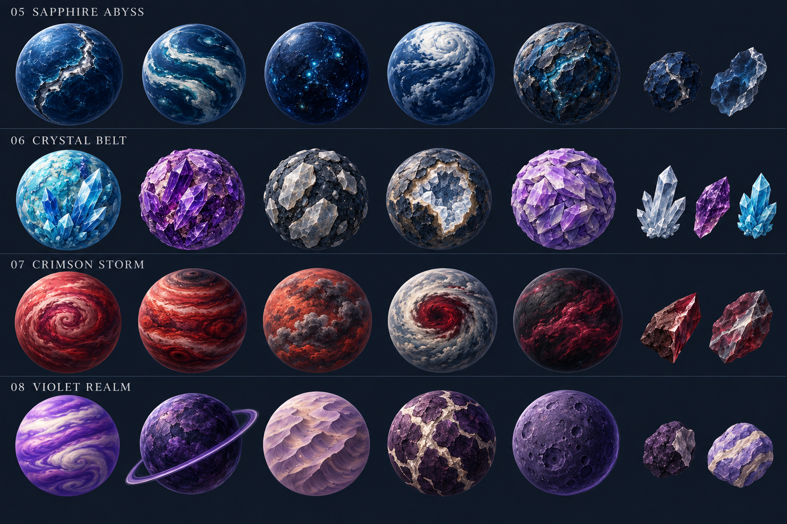

Current preferred planets: P26, P13, P23, P08. Current debris: D09, D18.

| Proposed planet | Action / visual brief |
|---|---|
| Trench World | **New.** indigo ocean cut by one silver-lit abyssal fault. |
| Tidal Bands | **New.** navy planet crossed by broad curved pale tidal bands. |
| Ink Sea | **New.** near-black blue globe with sparse bioluminescent pinpricks. |
| Whitecap Giant | **New.** dark sapphire gas-sea globe with a dense white storm cap. |
| Pressure Reef | **New.** dark mineral seabed sphere with compact blue ridges and pale edge light. |

Debris: Abyss Stone (new: rounded dense navy stone with a silver fracture); Pressure Glass (new: thick smoky blue fragment with a pale beveled edge).

Remove from this zone’s preferred lists: planets **P26, P13, P23, P08**; debris **D09, D18**. Rehome rather than delete.

Progression role: A quiet deep-water chapter between fire and crystal. Distinguish it from Coral Shallows through pressure, darkness and minimal exposed reef.

### 06 · Crystal Belt · levels 51–60

**Direction: An exposed mineral belt.** Palette: cyan / quartz white / amethyst. Editorial assessment: rebuild.

The strong crystal panorama already does much of the work. Its preferred planets are chalk, moon, eye, sand and rust; the two actual crystal worlds live elsewhere.

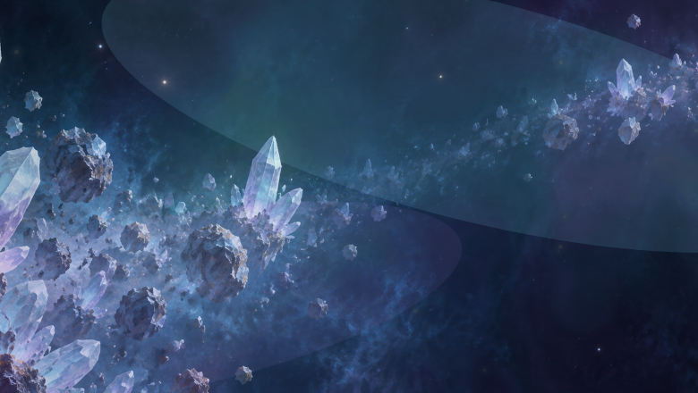

Concept illustration: row 2 of the [zones 5–8 family board](concept-05-08.png).

Current preferred planets: P24, P02, P12, P06, P16, P18. Current debris: D21, D00, D03.

| Proposed planet | Action / visual brief |
|---|---|
| Cyan Crystal Core | Use existing **P28** unchanged. |
| Amethyst Core | Use existing **P10** unchanged. |
| Quartz Mantle | **New.** rounded dark globe studded with broad milky quartz plates. |
| Smoky Geode | **New.** round smoky mineral shell with one pale open geode face. |
| Tabular World | **New.** spherical mineral mass built from short flat lavender crystal plates. |

Debris: Quartz Cluster (D02, existing); Amethyst Shard (D06, existing); Cyan Cluster (D13, existing).

Remove from this zone’s preferred lists: planets **P24, P02, P12, P06, P16, P18**; debris **D21, D00, D03**. Rehome rather than delete.

Progression role: Create recognition through thick solid facets. Prism Storm later uses thin glass skins and optical coatings, so the two chapters do not become duplicate crystal sets.

### 07 · Crimson Storm · levels 61–70

**Direction: Atmospheric violence.** Palette: burgundy / scarlet / storm grey. Editorial assessment: rebuild.

The inferno backdrop suggests a red storm, yet the preferred pool includes aurora, lightning cities, a vortex and purple crystal. Gold nugget is the sole debris type.

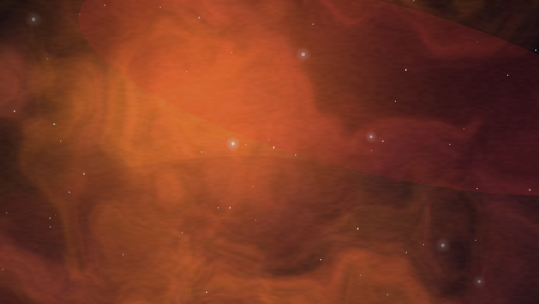

Concept illustration: row 3 of the [zones 5–8 family board](concept-05-08.png).

Current preferred planets: P15, P11, P17, P27, P10, P24. Current debris: D15.

| Proposed planet | Action / visual brief |
|---|---|
| Red Cyclone | Use existing **P21** unchanged. |
| Scarlet Bands | **New.** scarlet gas world with broad storm bands and a dark pole. |
| Ironcloud | **New.** rust-red cloud planet with slate thunderheads. |
| Pale Supercell | **New.** pale grey atmosphere with one large dark-red storm eye. |
| Ember Squall | **New.** near-black globe with sweeping burgundy cloud streaks. |

Debris: Hematite Shard (new: dark red metallic shard with a bright cut face); Stormglass (new: smoky red angular glass enclosing pale streaks).

Remove from this zone’s preferred lists: planets **P15, P11, P17, P27, P10, P24**; debris **D15**. Rehome rather than delete.

Progression role: Let swirling surfaces convey the storm without added flashes or higher obstacle density. Keep red atmospheric motion distinct from Furnace lava seams.

### 08 · Violet Realm · levels 71–80

**Direction: Quiet violet celestial worlds.** Palette: violet / plum / lavender / ivory. Editorial assessment: rebuild.

The vortex sky is clear, but green forest, ochre rings, lava and blue vortex planets make the foreground a general sampler.

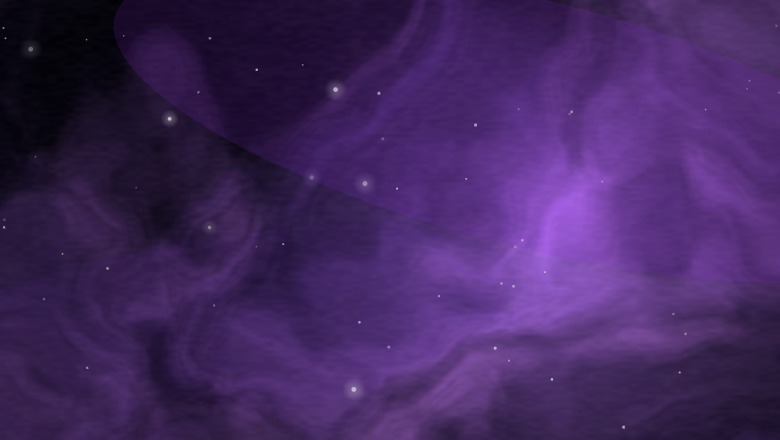

Concept illustration: row 4 of the [zones 5–8 family board](concept-05-08.png).

Current preferred planets: P20, P09, P01, P14, P07. Current debris: D08, D25.

| Proposed planet | Action / visual brief |
|---|---|
| Violet Cloud Sea | Use existing **P30** unchanged. |
| Dusk Rings | Use existing **P27** unchanged. |
| Lavender Dunes | **New.** muted lavender sand globe with large wind-carved ridges. |
| Plum Marble | **New.** deep plum solid world with thick ivory mineral veins. |
| Amethyst Moon | **New.** smooth dark violet cratered globe with a restrained lavender rim. |

Debris: Violet Basalt (new: compact dark plum rock with a pale broken face); Veined Pebble (new: rounded lavender stone with broad ivory veins).

Remove from this zone’s preferred lists: planets **P20, P09, P01, P14, P07**; debris **D08, D25**. Rehome rather than delete.

Progression role: A calm, regal pause after Crimson Storm. Keep forms spherical and solid; the background vortex should not be duplicated as a bounceable hole.

### 09 · Monochrome Void · levels 81–90

**Direction: Color disappears; texture remains.** Palette: ivory / neutral grey / graphite. Editorial assessment: rebuild.

The grey sky is paired with rainbow continents, candy bands, aurora rings and purple crystal. That creates contrast but undermines the monochrome promise.

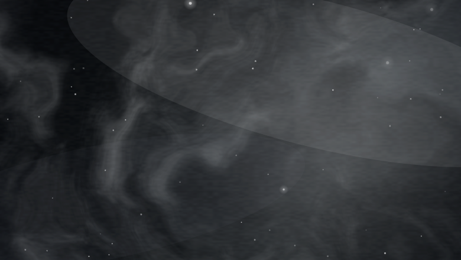

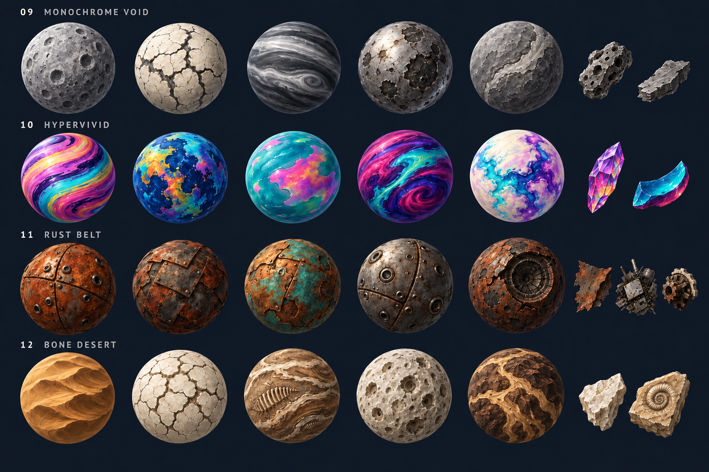

Current preferred planets: P19, P13, P15, P10. Current debris: D18, D23, D19, D09, D06.

| Proposed planet | Action / visual brief |
|---|---|
| Old Grey Moon | Use existing **P05** unchanged. |
| Alabaster Fault | **New.** off-white sphere with bold graphite fissures. |
| Graphite Bands | **New.** dark grey gas world with broad silver bands. |
| Iron Pearl | **New.** brushed silver globe with hammered dark impact patches. |
| Two-Tone Moon | **New.** neutral grey planet divided by one sweeping pale geological basin. |

Debris: Crater Rock (D00, existing); Regolith Slab (D03, existing).

Remove from this zone’s preferred lists: planets **P19, P13, P15, P10**; debris **D18, D23, D19, D09, D06**. Rehome rather than delete.

Progression role: Make the loss of color a memorable transition into level 81. Shape and value provide variety before Hypervivid restores saturation.

**Refine before production:** Keep hard neutral geology distinct from the eroded smoky surfaces proposed for Ghost Nebula.

### 10 · Hypervivid · levels 91–100

**Direction: Liquid color and pigment.** Palette: magenta / cyan / yellow / midnight. Editorial assessment: rebuild.

The distinctive ribbon panorama currently has only two grey moons in its preferred pool. It is visually memorable behind a particularly repetitive foreground.

Concept illustration: row 2 of the [zones 9–12 family board](concept-09-12.png).

Current preferred planets: P02, P05. Current debris: D10, D03, D00.

| Proposed planet | Action / visual brief |
|---|---|
| Ribbon World | Use existing **P13** unchanged. |
| Pigment Continents | Use existing **P19** unchanged. |
| Cyan Oil-Sheen | **New.** teal sphere with smooth broad pink iridescent pools. |
| Magenta Whorl | **New.** magenta and midnight gas globe with large curved turquoise streaks. |
| Opal Ink | **New.** cream pearl planet marbled with separated cyan and violet ink blooms. |

Debris: Colorglass (D18, existing); Lacquer Chip (new: curved glossy cyan fragment with a magenta underside).

Remove from this zone’s preferred lists: planets **P02, P05**; debris **D10, D03, D00**. Rehome rather than delete.

Progression role: The first 100-level finale should feel like color returning. Five different surface patterns sustain the late-zone run without more visual noise.

### 11 · Rust Belt · levels 101–110

**Direction: An abandoned orbital foundry.** Palette: rust / gunmetal / verdigris. Editorial assessment: rebuild.

The industrial panorama is excellent. Blue vortex, lightning, aurora and teal rings plus ice/crystals do not carry that industrial story into play.

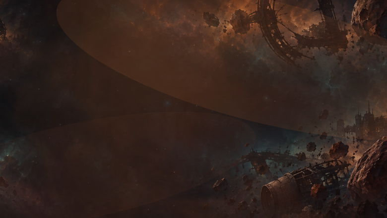

Concept illustration: row 3 of the [zones 9–12 family board](concept-09-12.png).

Current preferred planets: P07, P29, P15, P04. Current debris: D16, D19, D11.

| Proposed planet | Action / visual brief |
|---|---|
| Rivet World | Use existing **P16** unchanged. |
| Oxide Plates | Use existing **P18** unchanged. |
| Verdigris Shell | **New.** weathered copper sphere with large teal oxidized panels. |
| Bolted Moon | **New.** grey iron globe with recessed circular fasteners and wide seams. |
| Foundry Core | **New.** solid round furnace shell with one dark recessed cast-metal basin. |

Debris: Rust Sheet (D26, existing); Machine Wreck (D04, existing); Broken Cog (new: compact rusted gear section with a pale worn edge).

Remove from this zone’s preferred lists: planets **P07, P29, P15, P04**; debris **D16, D19, D11**. Rehome rather than delete.

Progression role: Level 101 starts the 100-gate tier. Use a decisive material change to mark that milestone; keep scrap silhouettes distinct from the round safe-contact worlds.

### 12 · Bone Desert · levels 111–120

**Direction: Fossils and dry sediment.** Palette: chalk / sand / umber. Editorial assessment: rebuild.

This gold-sky zone currently favors a blue vortex, two lava worlds and ice crust. Its selected debris is also lava/void themed.

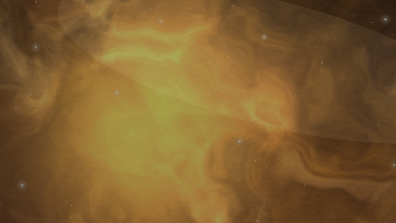

Concept illustration: row 4 of the [zones 9–12 family board](concept-09-12.png).

Current preferred planets: P07, P32, P31, P14. Current debris: D22, D12, D14.

| Proposed planet | Action / visual brief |
|---|---|
| Dune World | Use existing **P06** unchanged. |
| Chalk Shell | Use existing **P24** unchanged. |
| Fossil Seam | **New.** umber sediment globe with broad ivory fossil-like bands. |
| Porous Bone | **New.** pale round weathered limestone world with dark large pores. |
| Canyon Relic | **New.** dark brown globe carved by wide tan eroded channels. |

Debris: Chalk Fragment (D20, existing); Fossil Slab (new: short ivory sediment slab showing a curved fossil impression).

Remove from this zone’s preferred lists: planets **P07, P32, P31, P14**; debris **D22, D12, D14**. Rehome rather than delete.

Progression role: Keep this chapter matte, dry and archaeological. Golden Hour follows with luminous amber surfaces; Solar Corona then moves to scorched high-contrast shells.

### 13 · Golden Hour · levels 121–130

**Direction: Amber light trapped in worlds.** Palette: honey / bronze / amber / deep brown. Editorial assessment: rebuild.

The warm backdrop is coherent, but rust worlds, an eye planet and metal wrecks make it feel more like another scrapyard than a golden-hour destination.

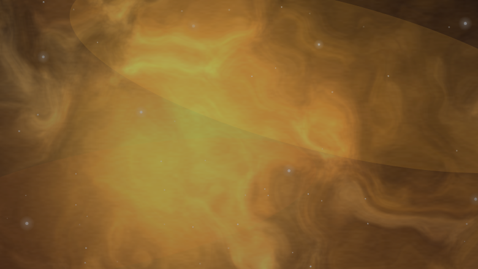

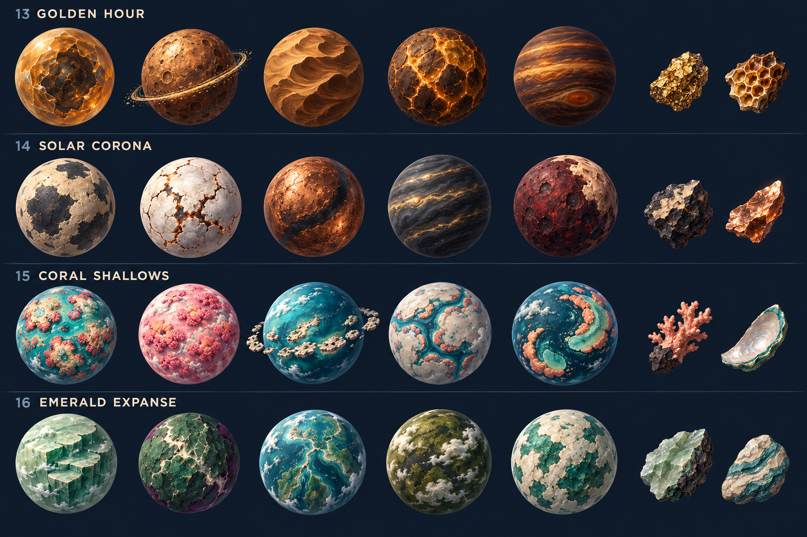

Current preferred planets: P18, P16, P12, P24. Current debris: D07, D05, D04.

| Proposed planet | Action / visual brief |
|---|---|
| Amber Globe | **New.** translucent-looking honey shell over a clearly solid dark round core. |
| Dust Halo | **New.** bronze solid world with one thin pale gold dusty belt. |
| Burnished Dunes | **New.** dark ochre globe with silky bronze dune ridges. |
| Honeycomb World | **New.** round umber sphere carrying broad honey-gold cellular plates. |
| Smoked Gold | **New.** dark brown gas giant with subdued amber horizontal bands. |

Debris: Gold Ore (D15, existing); Honeycomb Fragment (D25, existing).

Remove from this zone’s preferred lists: planets **P18, P16, P12, P24**; debris **D07, D05, D04**. Rehome rather than delete.

Progression role: The middle gold-sky chapter is warm and luminous rather than dry or destructive. Use dark umber boundaries so warm foreground objects remain readable.

**Refine before production:** The amber/honeycomb illustration reads too molten. Final art should have non-emissive cellular plates and amber material rather than lava glow.

### 14 · Solar Corona · levels 131–140

**Direction: Sun-scorched surfaces.** Palette: porcelain / carbon / copper light. Editorial assessment: rebuild.

The set has some heat cues, but red storm, lightning and city worlds recur elsewhere. It needs its own solar material language.

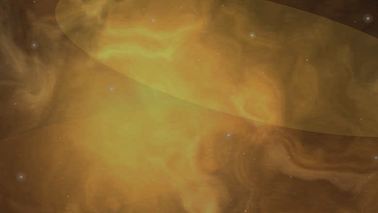

Concept illustration: row 2 of the [zones 13–16 family board](concept-13-16.png).

Current preferred planets: P29, P03, P25, P21. Current debris: D22, D16, D14, D25.

| Proposed planet | Action / visual brief |
|---|---|
| Sunspot Shell | **New.** ivory solar-baked globe with three broad carbon-dark basins. |
| Corona Ceramic | **New.** porcelain sphere with dark cracks and a narrow copper-lit edge. |
| Copper Mirror | **New.** solid burnished copper globe with a single dark curved reflection band. |
| Heat Bands | **New.** charcoal gas sphere with widely spaced pale-gold thermal bands. |
| Dusk Scorch | **New.** dark burgundy rocky planet with one pale sun-scorched hemisphere. |

Debris: Solar Clinker (new: dark baked rock with pale scorched crust); Coronal Flake (new: compact copper-colored metal flake with a white-hot-looking painted edge).

Remove from this zone’s preferred lists: planets **P29, P03, P25, P21**; debris **D22, D16, D14, D25**. Rehome rather than delete.

Progression role: Complete the gold-sky trilogy with strong light/dark boundaries. The corona is painted into material; no new flashing halo or collision extension is proposed.

### 15 · Coral Shallows · levels 141–150

**Direction: Living shallow-water worlds.** Palette: coral pink / lagoon teal / pearl. Editorial assessment: refine.

The existing teal, cyan and aurora family harmonizes with the magenta sky, but the actual coral globe and pink lobed globe are assigned elsewhere.

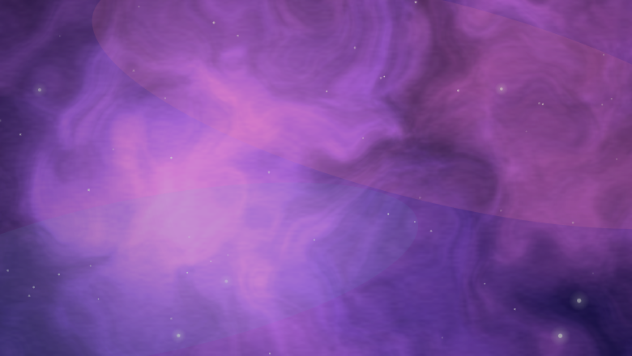

Concept illustration: row 3 of the [zones 13–16 family board](concept-13-16.png).

Current preferred planets: P04, P28, P20, P15. Current debris: D13, D11, D16.

| Proposed planet | Action / visual brief |
|---|---|
| Coral Archipelago | Use existing **P23** unchanged. |
| Rose Reef | Use existing **P26** unchanged. |
| Atoll Shell | **New.** teal round ocean world ringed by irregular pale shell islands. |
| Pearl Tide | **New.** pearl-grey globe with broad deep-teal channels and small coral ridges. |
| Kelp Lagoon | **New.** dark teal world with distinct peach reef crescents and shallow mint pools. |

Debris: Coral Fragment (new: short dense peach coral branch with a dark broken base); Shell Shard (new: pearly curved shell fragment with a teal edge).

Remove from this zone’s preferred lists: planets **P04, P28, P20, P15**; debris **D13, D11, D16**. Rehome rather than delete.

Progression role: Make this the warm, shallow counterpart to Sapphire Abyss. Compact coral ridges should read as surface detail, not enormous protruding collision spikes.

**Refine before production:** Keep coral ridges compact and measure any silhouette extensions around the solid collision core.

### 16 · Emerald Expanse · levels 151–160

**Direction: Ordered green geology.** Palette: jade / teal / pale stone / plum edge. Editorial assessment: rebuild.

The green backdrop is paired with red storms, purple gas, lilac flora and rainbow continents. Their contrast is useful; their geography is not specific.

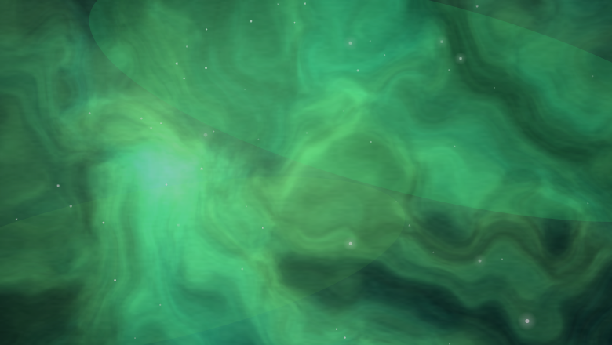

Concept illustration: row 4 of the [zones 13–16 family board](concept-13-16.png).

Current preferred planets: P21, P30, P22, P19. Current debris: D09, D13, D02, D06.

| Proposed planet | Action / visual brief |
|---|---|
| Jade Terraces | **New.** pale jade sphere with large stepped mineral terraces. |
| Malachite World | **New.** green stone globe with ivory veins and a restrained plum edge. |
| River Delta | **New.** teal planet with broad pale branching river deltas. |
| Olive Cloudlands | **New.** dark olive sphere with cream cloud islands. |
| Moss Continents | **New.** ivory rocky globe with large flat emerald continental patches. |

Debris: Jade Chip (new: pale jade slab with a dark fractured edge); Riverstone (new: rounded ivory and teal sediment stone).

Remove from this zone’s preferred lists: planets **P21, P30, P22, P19**; debris **D09, D13, D02, D06**. Rehome rather than delete.

Progression role: Begin the green-background sequence with ordered rivers, terraces and mineral surfaces. Avoid dense tree silhouettes reserved for the next zone.

### 17 · Alien Jungle · levels 161–170

**Direction: Dense and strange living worlds.** Palette: forest green / bark / lilac spores. Editorial assessment: refine.

The forest world fits, but a ten-planet preferred pool mixes ice, candy, storm, coral and vortex motifs. It dilutes a good jungle idea.

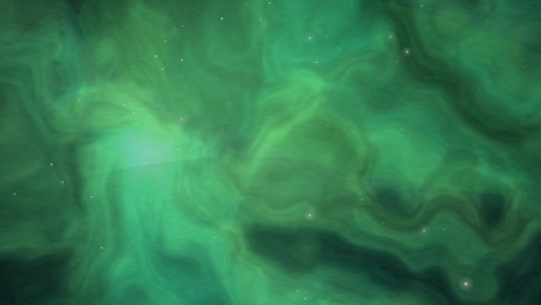

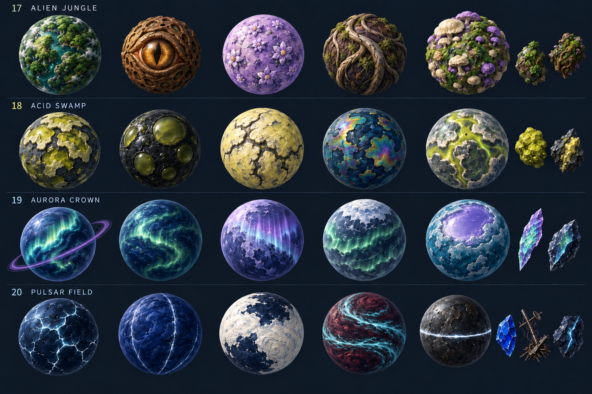

Current preferred planets: P08, P30, P21, P10, P09, P26, P13, P17, P23, P22. Current debris: D24, D26, D05, D01.

| Proposed planet | Action / visual brief |
|---|---|
| Canopy World | Use existing **P09** unchanged. |
| Watchful Seed | Use existing **P12** unchanged. |
| Lilac Bloom | Use existing **P22** unchanged. |
| Rootbound | **New.** dark round bark world wrapped in broad pale roots. |
| Spore Mound | **New.** rounded mossy world with compact cream and lilac fungal caps. |

Debris: Overgrown Rock (D17, existing); Root Knot (new: compact tangled woody fragment with moss on one side).

Remove from this zone’s preferred lists: planets **P08, P30, P21, P10, P26, P13, P17, P23**; debris **D24, D26, D05, D01**. Rehome rather than delete.

Progression role: Grow from Emerald geometry into organic abundance. Keep the eye planet exclusive and uncommon enough to feel like a local discovery, without reducing the other four to filler.

### 18 · Acid Swamp · levels 171–180

**Direction: Chemical pools and unstable crust.** Palette: sulfur / tar / petrol blue / pale salt. Editorial assessment: rebuild.

Purple gas, violet rings and rainbow planets recur here; ice and aurora shards do little to establish a swamp.

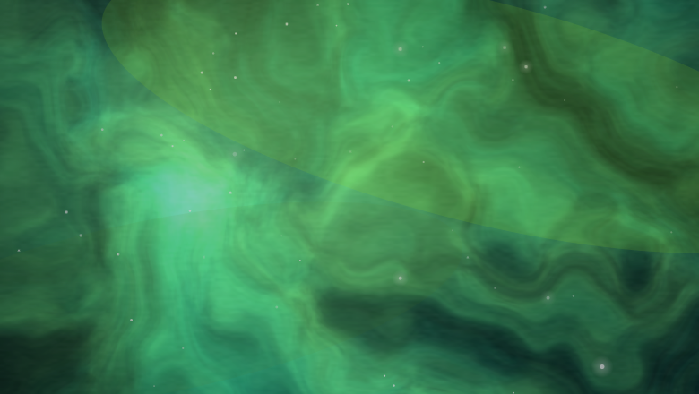

Concept illustration: row 2 of the [zones 17–20 family board](concept-17-20.png).

Current preferred planets: P30, P27, P13, P19. Current debris: D19, D11.

| Proposed planet | Action / visual brief |
|---|---|
| Sulfur Flats | **New.** yellow-green salt plates over a dark slate sphere. |
| Tar Bubble | **New.** round near-black world with large smooth olive bubble basins. |
| Lime Crust | **New.** pale sulfur globe with thick dark cracks and no neon bloom. |
| Petrol Marsh | **New.** dark blue-green sphere with contained iridescent oily pools. |
| Acid Lagoon | **New.** slate round world divided by broad chartreuse channels and pale salt rims. |

Debris: Sulfur Ore (D24, existing); Tar Shard (new: dark compact glossy fragment with a pale sulfur deposit).

Remove from this zone’s preferred lists: planets **P30, P27, P13, P19**; debris **D19, D11**. Rehome rather than delete.

Progression role: Make the green sequence turn mineral and inhospitable after the living jungle. Preserve clear pale or dark edges against the unchanged verdant sky.

**Refine before production:** Make Petrol Marsh dark oily pools rather than rainbow landmasses, so it does not repeat Hypervivid.

### 19 · Aurora Crown · levels 181–190

**Direction: Polar light on solid worlds.** Palette: teal / icy lavender / deep blue. Editorial assessment: refine.

The title promises aurora, but its namesake aurora-ringed planet is absent while red storm, rose moon and ochre rings dominate the pool.

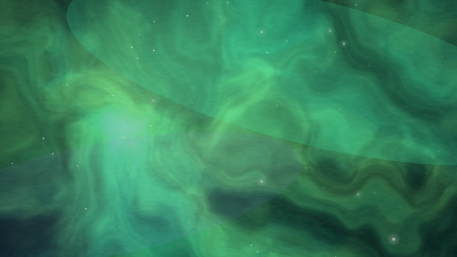

Concept illustration: row 3 of the [zones 17–20 family board](concept-17-20.png).

Current preferred planets: P08, P30, P21, P01. Current debris: D09, D13, D23.

| Proposed planet | Action / visual brief |
|---|---|
| Aurora Crown | Use existing **P15** unchanged. |
| Green Veil | Use existing **P20** unchanged. |
| Boreal Dusk | **New.** dark blue globe with a broad pale-violet polar curtain painted across its surface. |
| Frosted Magnetosphere | **New.** slate sphere with restrained mint bands and an icy cap. |
| Polar Mirror | **New.** deep teal world with a large reflective lavender polar basin. |

Debris: Aurora Shard (D19, existing); Frostfoil (new: compact icy slate shard with a thin teal iridescent face).

Remove from this zone’s preferred lists: planets **P08, P30, P21, P01**; debris **D09, D13, D23**. Rehome rather than delete.

Progression role: End the four consecutive green chapters with airy light and polar symmetry. Keep aurora color confined to surfaces; no flashing or oversized glow.

### 20 · Pulsar Field · levels 191–200

**Direction: Charged magnetic worlds.** Palette: navy / ice white / muted electric cyan. Editorial assessment: rebuild.

Lava and rust planets provide contrast against the ice sky but read as another furnace. The existing electric-crack planet is a stronger anchor.

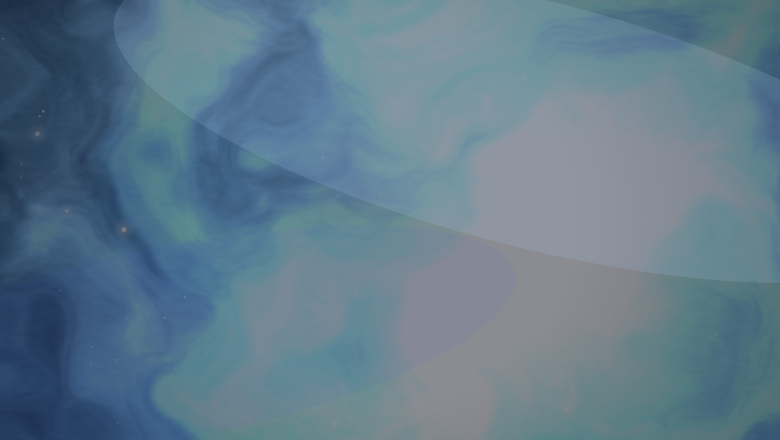

Concept illustration: row 4 of the [zones 17–20 family board](concept-17-20.png).

Current preferred planets: P03, P21, P16, P14. Current debris: D12, D14, D07.

| Proposed planet | Action / visual brief |
|---|---|
| Charge Lattice | Use existing **P29** unchanged. |
| Magnetar Core | **New.** dark cobalt sphere with thin pale meridian seams. |
| Polar Ceramic | **New.** ivory planet with large dark navy polar plates. |
| Charge Stripes | **New.** burgundy-black sphere with broad static cyan magnetic bands. |
| Iron Equator | **New.** dark iron globe with one sharply defined pale equatorial seam. |

Debris: Charged Sapphire (D16, existing); Broken Receiver (D07, existing); Magnetic Slag (new: dense navy fragment crossed by one pale cyan seam).

Remove from this zone’s preferred lists: planets **P03, P21, P16, P14**; debris **D12, D14**. Rehome rather than delete.

Progression role: Close the 100-gate tier with crisp directional marks. Static charge patterns can communicate energy without a readability-hostile pulse effect.

### 21 · Time Fracture · levels 201–210

**Direction: Time recorded in layered matter.** Palette: aged bronze / slate / mint seams. Editorial assessment: rebuild.

The fractured night world is a useful anchor. Purple gas, red storm and an intact night-city world make the rest feel borrowed.

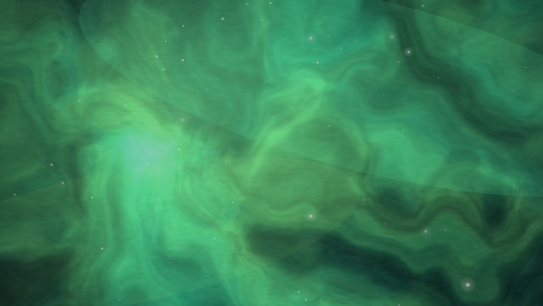

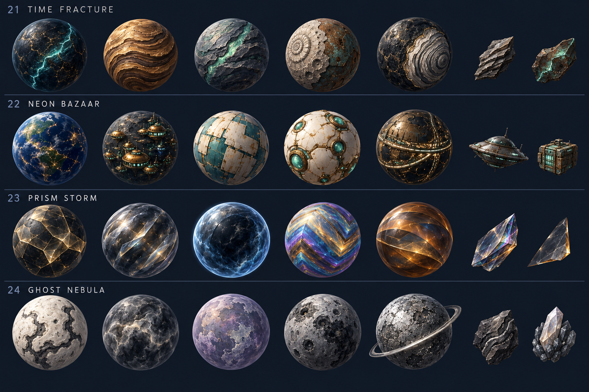

Current preferred planets: P30, P21, P11, P25. Current debris: D16, D20.

| Proposed planet | Action / visual brief |
|---|---|
| Fractured Chronicle | Use existing **P11** unchanged. |
| Clockstone | **New.** stratified bronze globe with broad nested growth bands. |
| Offset Seam | **New.** solid slate sphere whose surface strata shift across one mint fault. |
| Two Ages | **New.** round world with one fossil-stone half and one weathered-alloy half. |
| Archive Shell | **New.** dark globe with pale exposed concentric geological layers. |

Debris: Time Stratum (new: compact stone shard with staggered layered faces); Archive Fragment (new: aged metal fragment crossed by one clean mint seam).

Remove from this zone’s preferred lists: planets **P30, P21, P25**; debris **D16, D20**. Rehome rather than delete.

Progression role: Level 201 doubles the main Free Flight cap to 200 gates. Make all five forms familiar early in the zone, then vary order; do not save most diversity for the finale.

**Refine before production:** Keep the aged-alloy half of Two Ages prominent; avoid making another fossil-led Bone Desert planet.

### 22 · Neon Bazaar · levels 211–220

**Direction: Inhabited trading worlds.** Palette: aged brass / mint / glazed cream. Editorial assessment: refine.

The panorama and saucer debris suggest a market. The eye, dunes, brain-like globe and ordinary Earth do not consistently support the inhabited setting.

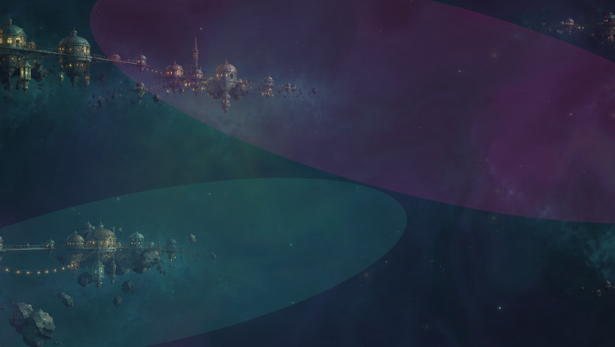

Concept illustration: row 2 of the [zones 21–24 family board](concept-21-24.png).

Current preferred planets: P12, P06, P26, P00. Current debris: D05, D17.

| Proposed planet | Action / visual brief |
|---|---|
| Night Market | Use existing **P25** unchanged. |
| Lantern Domes | **New.** dark round world with small brass dome clusters and steady mint windows. |
| Freight Mosaic | **New.** solid globe of large worn cream and teal cargo-like panels. |
| Merchant Ceramic | **New.** glazed cream planet with brass seams and inset teal round ports. |
| Tramline World | **New.** dark brass sphere with broad tidy illuminated orbital streets. |

Debris: Abandoned Saucer (D05, existing); Freight Crate (new: compact weathered brass and mint cargo module without text).

Remove from this zone’s preferred lists: planets **P12, P06, P26, P00**; debris **D17**. Rehome rather than delete.

Progression role: A late inhabited respite. Architecture belongs on the surfaces of clearly round worlds; reserve detached angular objects for hazards.

### 23 · Prism Storm · levels 221–230

**Direction: Thin optical layers under strain.** Palette: smoked glass / pale gold / spectral edges. Editorial assessment: rebuild.

The striking diagonal panorama is paired with chalk, moons and an eye; mixed rust and satellite debris weaken the refraction theme.

Concept illustration: row 3 of the [zones 21–24 family board](concept-21-24.png).

Current preferred planets: P24, P02, P12, P05. Current debris: D21, D26, D01, D10.

| Proposed planet | Action / visual brief |
|---|---|
| Gold Refraction | **New.** dark solid sphere with broad thin pale-gold glass plates. |
| Smoked Mirror | **New.** smoky round globe with large angled silver reflection bands. |
| Glass Mantle | **New.** black solid core under a pale blue transparent-looking continuous shell. |
| Dichroic World | **New.** rounded globe with broad cyan-gold-violet chevron coatings. |
| Honey Lens | **New.** dark amber sphere with overlapping smooth optical lens bands. |

Debris: Spectral Glass (D23, existing); Smoked Shard (new: thin smoky triangular glass with a restrained golden cut edge).

Remove from this zone’s preferred lists: planets **P24, P02, P12, P05**; debris **D21, D26, D01, D10**. Rehome rather than delete.

Progression role: Use thin smooth optical skins, not the thick crystal outcrops of zone 6 or the liquid-color ribbons of zone 10. Keep strong compact silhouette boundaries.

### 24 · Ghost Nebula · levels 231–240

**Direction: Eroded and spectral remains.** Palette: smoke / pearl / tarnished silver. Editorial assessment: rebuild.

The pale sky has a clear spectral mood. Ordinary Earth and night cities create useful dark contrast, but do not tell a ghostly story.

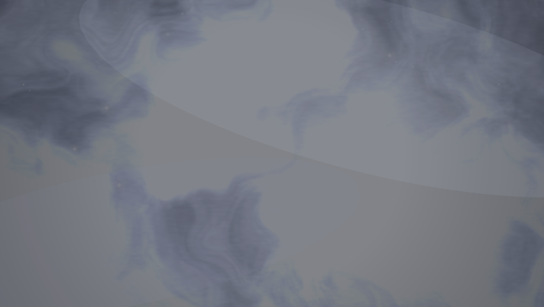

Concept illustration: row 4 of the [zones 21–24 family board](concept-21-24.png).

Current preferred planets: P27, P25, P11, P00. Current debris: D17, D21.

| Proposed planet | Action / visual brief |
|---|---|
| Etched Relic | **New.** ivory globe with bold charcoal eroded channels. |
| Fogbound | **New.** charcoal round world with soft pale mineral veils contained inside its outline. |
| Drowned Lilac | **New.** smoky lavender globe with pale drowned continent traces. |
| Ash Porcelain | **New.** round ash-grey shell with dark soot basins. |
| Tarnished Halo | **New.** dark silver solid world with a thin weathered pale ring. |

Debris: Ash Ruin (new: dark weathered stone fragment with pale etched grooves); Spectral Gravel (new: compact smoky-grey mineral cluster with one pearly face).

Remove from this zone’s preferred lists: planets **P27, P25, P11, P00**; debris **D17, D21**. Rehome rather than delete.

Progression role: Bring saturation down after Prism Storm. Ghostliness must come from patina and muted surfaces, never from making a collision-bearing planet transparent.

**Refine before production:** Use worn spectral surface detail with opaque cores and dark boundaries; avoid five recolored Monochrome moons.

### 25 · Blackout Zone · levels 241–250

**Direction: Quiet dark matter and cold rock.** Palette: navy / graphite / slate / sparse silver. Editorial assessment: rebuild.

The dark jagged panorama is distinctive. Rainbow continents, candy bands, bright cyan crystal and aurora rings undercut the blackout mood.

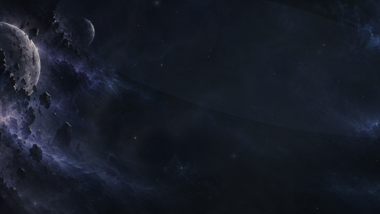

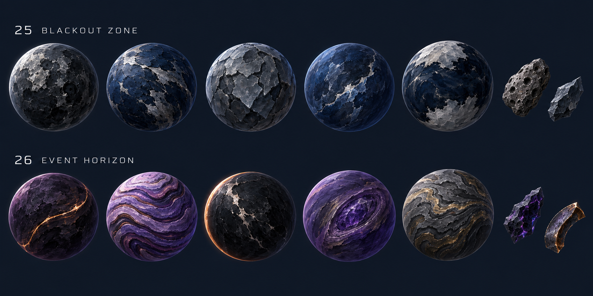

Current preferred planets: P19, P13, P28, P15. Current debris: D25, D11, D20.

| Proposed planet | Action / visual brief |
|---|---|
| Graphite Sentinel | **New.** dark graphite sphere with a crisp cool pale rim and broad rough patches. |
| Scratched Iron | **New.** navy iron globe with a few wide silver scars. |
| Slate Basalt | **New.** solid slate world with large angular surface plates. |
| Cobalt Fault | **New.** muted dark cobalt sphere with one pale broken fault. |
| Ash Poles | **New.** near-black blue globe with large ash-grey polar caps. |

Debris: Iron Rock (D08, existing); Slate Fragment (D10, existing).

Remove from this zone’s preferred lists: planets **P19, P13, P28, P15**; debris **D25, D11, D20**. Rehome rather than delete.

Progression role: A restrained penultimate chapter. Compare these dark worlds at game size before approval; the existing dark debris may need a future edge-light repair if it fails against this scene.

**Refine before production:** Review dark planet and debris edges at game size against the darkest background regions.

### 26 · Event Horizon · levels 251–260

**Direction: Gravity written into solid worlds.** Palette: black plum / violet / narrow copper gold. Editorial assessment: refine.

The accretion panorama already gives the finale a strong identity. Aurora, rainbow continents and city lights weaken its focused gravity story.

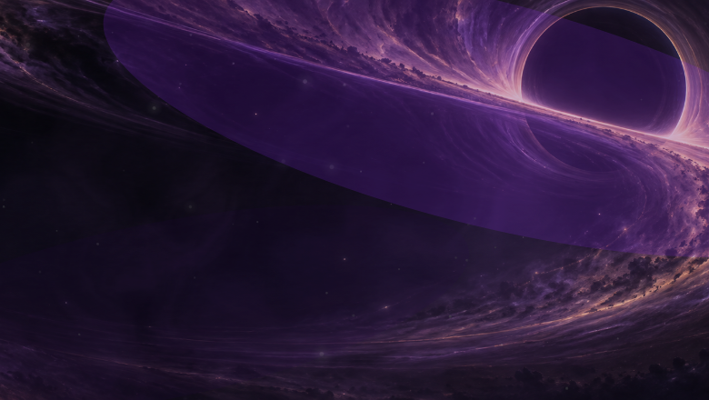

Concept illustration: row 2 of the [zones 25–26 family board](concept-25-26.png).

Current preferred planets: P20, P15, P19, P27, P25. Current debris: D20, D22.

| Proposed planet | Action / visual brief |
|---|---|
| Accretion World | **New.** solid black-plum sphere crossed by one narrow curved copper-gold seam. |
| Compressed Strata | **New.** violet globe with tightly packed sweeping geological layers. |
| Last Light | **New.** jet-black solid planet with a clear narrow copper rim and pale surface scar. |
| Lens Scar | **New.** smooth dark violet globe carrying one distorted oval mineral basin. |
| Tidal Fold | **New.** solid graphite sphere with broad flowing folded crust highlighted in muted gold. |

Debris: Void Fragment (D22, existing); Dense Arc (new: short bowed dark metallic shard with a clear copper cut face).

Remove from this zone’s preferred lists: planets **P20, P15, P19, P27, P25**; debris **D20**. Rehome rather than delete.

Progression role: The 200-gate finale needs sustained variety without a brighter, busier field. Keep the round solid core unmistakable and leave the real black-hole visual language to the background and portal.

**Refine before production:** Keep Lens Scar a solid oval basin rather than an open vortex; measure the dark debris boundary.

## Rollout proposal

Review the pilot group first: Ice Moon, Rust Belt, Bone Desert and Alien Jungle. Together they test a bright sky, a detailed industrial panorama, a shared gold sky and a shared green sky. They also test whether the existing ice/rust/fossil/forest assets feel better in their natural homes.

Then approve the five-world language before producing the full library. Phase 1 is a separately approved implementation of stable zone identity and anti-repeat selection in the pilot group. Phase 2 expands complete zone packs in chart order, with adjacent zones reviewed side by side. Phase 3 covers the separate Spill palette path and Arcade readability where applicable. Do not lock a zone to an incomplete one- or two-planet roster while waiting for the rest of its art.

The full plan needs 101 new planets and 28 new debris sprites: 129 new production assets. Rehoming 29 planets and 27 debris sprites reduces the amount of new art, but it is still a substantial art-production project. The seven concept boards below are not 129 individually finished sprites. A smaller first release should complete fewer zones at the full five-planet standard; retaining broad global reuse would not meet the requested experience.

## Production acceptance gates

- Exactly five unique planet IDs and two or three debris IDs per completed zone; zero exact planet IDs shared between zones. Review debris exclusivity with the same rule.
- In a visual-only seed sweep, each aligned five-item bag covers all five planets, with no immediate repeat at bag boundaries; top/bottom pairs stay matched. Compare mission geometry, rewards and objective IDs to baseline.
- Verify all 26 chart rows and flight families agree; include separate Spill and Arcade behavior rather than assuming they use the same selector.
- Render real foreground assets over the existing skies at phone portrait, phone landscape and desktop sizes, including brightest/darkest patches, fog, Deep/Lost dark variants and remaster crops. Inspect at actual play scale.
- Measure opaque core, alpha bounds, center and any ring/crystal/reef extensions. Verify bounce surfaces and hazardous debris remain visually distinguishable.
- Test missing assets without index shifts or foreign-zone fallback. Measure cold load, next-zone transition and decoded-memory costs.
- Run the repository build, typecheck, full art gate, complete test harness and platform bridge for the future implementation. Keep the implementation PR separate from this proposal.

## Evidence and limits

All current-code claims bind to [4b15f97fbdfc0e53f60f2536dfe9f64c3a3fe4dd](https://github.com/j6sistek-ui/AcornautSandbox/commit/4b15f97fbdfc0e53f60f2536dfe9f64c3a3fe4dd). Recheck the roster and selectors if main advances before implementation.

- `illustrated-src/game/catalog.ts`: ENVS, PLANET_COUNT, DEBRIS_COUNT, palette metadata and dark-sky routing.
- `illustrated-src/game/sim.ts:952–973`: planet/debris selection; `:1443–1470`: matching planet halves.
- `illustrated-src/game/zone-visuals.ts`: chart ordering, remaster paths, pan and map selection.
- `illustrated-src/game/sky-gen.ts` and `draw.ts:140–230`: current procedural backgrounds, scrim, remaster layer and washes.
- `illustrated-src/game/beta-campaign-manifest.ts` and `campaign.ts:351–365`: all 260 current authored missions and shared chart routing.
- `illustrated-src/game/spill.ts:650–661`: separate global readable-debris selector.
- `illustrated-src/game/art.ts:221–235,691–692`: sprite bank loading and array-compaction behavior.
- `illustrated-src/ZONE_PLANNER.md`: historical planner snapshot; its 70-thumbnail description is not the current 60-sprite roster. Its previously settled pools are explicitly re-reviewed by this new owner-requested study.
- `docs/art/planets/0.png` through `32.png`, `docs/art/debris/0.png` through `26.png`, all referenced sky and zone-scene assets.

This was a source/art review and a proposal-render inspection. It did not play all 260 levels or establish measured appearance percentages, completion durations or final collision/readability approval. No background, game source or progression file was edited. Docker was unavailable; existing bundled Python/Node/browser tools were used without installation. The proposal checks cover completeness, unique assignments, source asset identity, document links and desktop/mobile presentation. Source typecheck passed (all game TypeScript plus lab/rig.ts, TypeScript 5.9.2). The build was attempted but stopped before bundle generation because this scoped checkout omits art-src/spill-workshop/magnet.webp. The bridge check reports two unchanged // comment lines (engine.ts:263, save.ts:583): its stripping regex is sensitive to trailing CR; normalizing those two diagnostic strings removes both matches. No runtime source was fixed. The full art/gameplay harness was not run; there is no lint script. See verification.json for the bounded check results.

## Deliverables

- `index.html`: browse the 26 zone reviews locally; use Print for the full report.
- `proposal.json`: source snapshot and complete proposed asset ownership.
- `image-prompts.json`: exact built-in image-generation prompts for the seven concept boards.
- `concept-*.png`: concept boards, not production-ready cutouts.
- `reference/`: original planet/debris copies plus reconstructed background-layer studies.
- `reference-sha256.json`: reference artifact integrity.

## Additional review files

- [Original asset ownership](ASSET_OWNERSHIP.md)
- [Concept limitations and refinements](CONCEPT_NOTES.md)
- [Exact corrective image prompts](image-edit-prompts.json)
- [Proposal verification](verification.json)
